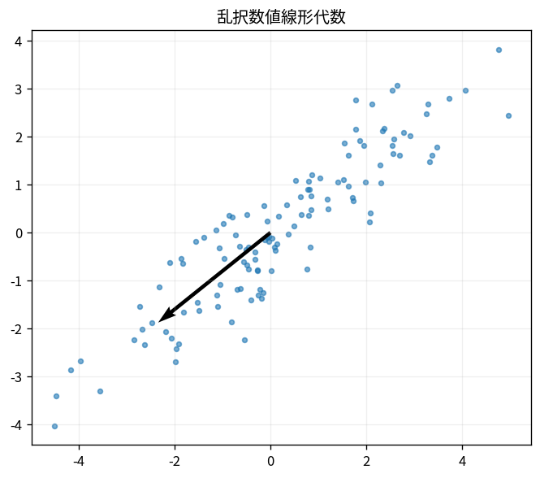

# 乱択数値線形代数

Course 05｜数値計算｜Topic 16/20

---
layout: center
---

## 今回の問い

## 到達目標

- 定義と代表式を、自分の言葉と記号で説明できる。
- 成立条件を確認し、手計算と結果を検算できる。

## 理解確認

- 定義・条件・計算結果を自分の言葉で説明できるか確認する。

乱択数値線形代数の代表式は、どの定義・仮定から、なぜその形になるのか。

---

## なぜ今これを学ぶのか

前Topic `num-regularization-ill-posed-problems` で得た概念を使い、ここでは 乱択数値線形代数 へ進む。

---

## 直感

乱択法は高次元構造を完全に読む代わりに、ランダムな部分空間へ写して主要情報を安価に捉える。

---

## 図解

高次元点間距離が低次元射影でも概ね保たれる様子を見る。 高次元点群を低次元へ写しても、ランダム写像を適切に正規化すれば点間距離が概ね保存される。元の距離と写像後距離の対応を散布として確認する。

---

## 記号と代表式

- $\Omega\in\mathbb R^{n\times(k+p)}$：random test matrix
- $Y=A\Omega$：sampled range
- $Q$：Yのorthonormal basis

$$
\mathbf{Y}=\mathbf{A}\mathbf{\Omega}
$$

---

## 導出 1

$Y=A\Omega=U\Sigma V^T\Omega$。V^TΩはrandom係数を各right singular directionへ与える。

---

## 導出 2

Σが係数をσ_i倍するためdominant singular subspaceがYで強調される。

---

## 例題

10000×10000だがeffective rank20なら、Ωを30列程度にしてAΩを計算し30次元subspaceへ圧縮できる。

---

## 条件を変えるとどうなるか

randomizedだから常に速いわけではない。matrixが小さい、rankが高い、data movementが支配的ならfull deterministic法が有利。

---

## よくある誤解

乱択数値線形代数では、式へ数値を代入するだけでは不十分である。randomizedだから常に速いわけではない。matrixが小さい、rankが高い、data movementが支配的ならfull deterministic法が有利。 という失敗例が示すように、式を使える条件と結論の範囲を区別する必要がある。

---

## 実装・計算上の注意

random seed、oversampling p、power qを記録。qualityは $\|A-QQ^TA\|$ やdownstream errorで検証する。

---

## 一段先へ

randomnessを「計算量削減」に使う考えはMonte Carloにも共通するが、目的と収束率は異なる。

---

## 自分で説明できるか

- 「random probeを通す」を式を見ずに説明できるか
- 「small matrixへ圧縮」までの論理を一段ずつ再現できるか
- 乱択数値線形代数の条件を1つ外した反例を説明できるか

---
layout: center
---

## 教科書と演習

- [教科書](../../textbook/num-randomized-numerical-linear-algebra)
- [10問の演習](../../exercises/num-randomized-numerical-linear-algebra)
