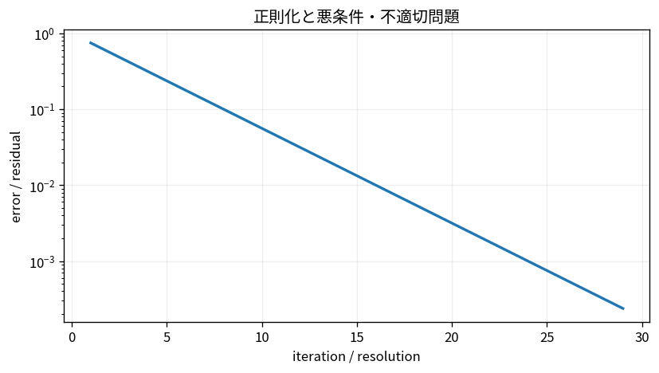

# 正則化と悪条件・不適切問題

Course 05｜数値計算｜Topic 15/20

---
layout: center
---

## 今回の問い

## 到達目標

- 定義と代表式を、自分の言葉と記号で説明できる。
- 成立条件を確認し、手計算と結果を検算できる。

## 理解確認

- 定義・条件・計算結果を自分の言葉で説明できるか確認する。

正則化と悪条件・不適切問題の代表式は、どの定義・仮定から、なぜその形になるのか。

---

## なぜ今これを学ぶのか

前Topic `num-svd-low-rank-computation` で得た概念を使い、ここでは 正則化と悪条件・不適切問題 へ進む。

---

## 直感

逆問題では観測ノイズが小さい特異値方向で大きく増幅されるため、正則化で安定性と忠実度を調整する。

---

## 図解

λを変えたときの残差と解ノルムのトレードオフを見る。 小さい特異値方向では観測ノイズが逆演算で1/σ_i倍に増幅される。正則化はその方向の逆増幅を抑え、biasとvarianceを交換する。

---

## 記号と代表式

- $\lambda\ge0$：regularization強度
- $\|Ax-b\|^2$：data fit
- $\|x\|^2$：solution size penalty

$$
\min_{\mathbf{x}}\|\mathbf{A}\mathbf{x}-\mathbf{b}\|_2^2+\lambda\|\mathbf{x}\|_2^2
$$

---

## 導出 1

$J(x)=\|Ax-b\|^2+\lambda\|x\|^2$。gradientは $2A^T(Ax-b)+2\lambda x$。

---

## 導出 2

0と置き $(A^TA+\lambda I)x=A^Tb$。λ>0ならnull方向にもcurvatureが加わる。

---

## 例題

σ=0.001方向をnaive inverseすると1000倍。λ=0.01ならfilter≈0.09999でnoise amplificationを強く抑える。

---

## 条件を変えるとどうなるか

regularizationは「正解を自動回復」する魔法ではない。penaltyが真のsolution構造に不適切ならbiasを導入する。

---

## よくある誤解

正則化と悪条件・不適切問題では、式へ数値を代入するだけでは不十分である。regularizationは「正解を自動回復」する魔法ではない。penaltyが真のsolution構造に不適切ならbiasを導入する。 という失敗例が示すように、式を使える条件と結論の範囲を区別する必要がある。

---

## 実装・計算上の注意

λはvalidation, L-curve, GCV等で選ぶ。feature scalingがpenalty効果へ直接影響するため標準化を検討。

---

## 一段先へ

large matrixではfull SVDを避けrandomized range finderでdominant subspaceを近似する方法がある。

---

## 自分で説明できるか

- 「目的関数を微分」を式を見ずに説明できるか
- 「SVD filterとして読む」までの論理を一段ずつ再現できるか
- 正則化と悪条件・不適切問題の条件を1つ外した反例を説明できるか

---
layout: center
---

## 教科書と演習

- [教科書](../../textbook/num-regularization-ill-posed-problems)
- [10問の演習](../../exercises/num-regularization-ill-posed-problems)
