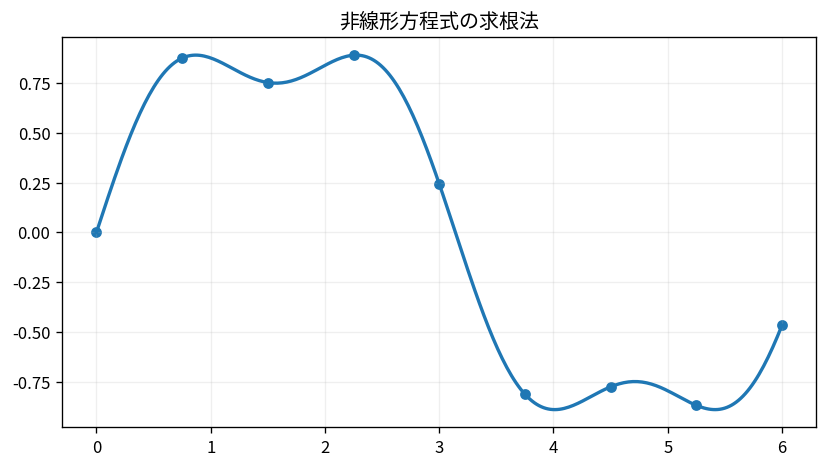

# 非線形方程式の求根法

Course 05｜数値計算｜Topic 04/20

---
layout: center
---

## 今回の問い

## 到達目標

- 定義と代表式を、自分の言葉と記号で説明できる。
- 成立条件を確認し、手計算と結果を検算できる。

## 理解確認

- 定義・条件・計算結果を自分の言葉で説明できるか確認する。

非線形方程式の求根法の代表式は、どの定義・仮定から、なぜその形になるのか。

---

## なぜ今これを学ぶのか

前Topic `num-convergence-orders-stopping` で得た概念を使い、ここでは 非線形方程式の求根法 へ進む。

---

## 直感

求根法はf(x)=0を直接解けないとき、現在点から次の近似点を反復的に作る。

---

## 図解

Newton法の接線と根へのジャンプをアニメーションで追う。 曲線がf(x)、現在点で引いた接線とx軸の交点が次のNewton反復である。接線による一次近似を0と置いて解くため、x_{k+1}=x_k-f(x_k)/f'(x_k)が現れる。

---

## 記号と代表式

- $f(x)=0$：求める根
- $x_k$：現在の近似
- $f^{\prime}(x_k)$：現在点の接線傾き

$$
x_{k+1}=x_k-\frac{f(x_k)}{f^{\prime}(x_k)}
$$

---

## 導出 1

$f(x_k+h)\approx f(x_k)+f^{\prime}(x_k)h$。真の根付近では左辺を0にしたい。

---

## 導出 2

$0=f(x_k)+f^{\prime}(x_k)h$ から $h=-f(x_k)/f^{\prime}(x_k)$。

---

## 例題

$f(x)=x^2-2$, x0=1。x1=1.5, x2=1.41667, x3≈1.41422 と $\sqrt2$ へ急速に近づく。

---

## 条件を変えるとどうなるか

$f^{\prime}(x_k)=0$ では更新不能。導関数が極小、rootから遠い、multiple rootでは発散・遅い・別根へ行くことがある。

---

## よくある誤解

非線形方程式の求根法では、式へ数値を代入するだけでは不十分である。$f^{\prime}(x_k)=0$ では更新不能。導関数が極小、rootから遠い、multiple rootでは発散・遅い・別根へ行くことがある。 という失敗例が示すように、式を使える条件と結論の範囲を区別する必要がある。

---

## 実装・計算上の注意

Newtonにbracketing/line searchを組み合わせるhybrid法が実務的。residualとstepを両方監視する。

---

## 一段先へ

非線形systemではfをvector、導関数をJacobianへ置換し、各stepで線形系を解く。

---

## 自分で説明できるか

- 「一次Taylor近似」を式を見ずに説明できるか
- 「更新式」までの論理を一段ずつ再現できるか
- 非線形方程式の求根法の条件を1つ外した反例を説明できるか

---
layout: center
---

## 教科書と演習

- [教科書](../../textbook/num-root-finding)
- [10問の演習](../../exercises/num-root-finding)
