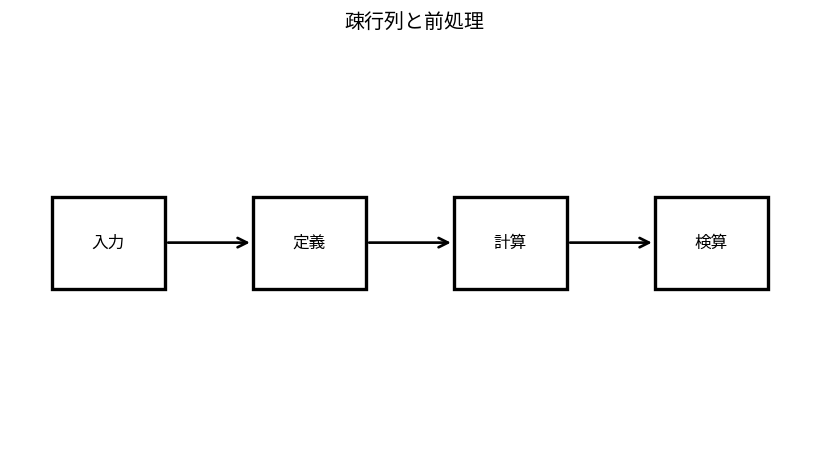

# 疎行列と前処理

Course 05｜数値計算｜Topic 11/20

---
layout: center
---

## 今回の問い

## 到達目標

- 定義と代表式を、自分の言葉と記号で説明できる。
- 成立条件を確認し、手計算と結果を検算できる。

## 理解確認

- 定義・条件・計算結果を自分の言葉で説明できるか確認する。

疎行列と前処理の代表式は、どの定義・仮定から、なぜその形になるのか。

---

## なぜ今これを学ぶのか

前Topic `num-iterative-linear-solvers` で得た概念を使い、ここでは 疎行列と前処理 へ進む。

---

## 直感

疎行列ではゼロを保存・計算しないことが計算量とメモリを大きく左右する。

---

## 図解

密行列と疎行列の非ゼロパターンを比較する。 非零要素だけが描かれたpatternは、保存量と演算量が全要素数mnではなく非零数nnzに比例しうることを示す。前処理はこの構造を使いながら難しい方向を縮める。

---

## 記号と代表式

- $A$：sparse係数行列
- $M$：解きやすくAに近いpreconditioner
- $M^{-1}A$：変換後operator

$$
\mathbf{M}^{-1}\mathbf{A}\mathbf{x}=\mathbf{M}^{-1}\mathbf{b}
$$

---

## 導出 1

$Ax=b$ の左から可逆M^{-1}を掛けても解xは同じ。

---

## 導出 2

M=Aなら変換後はIで一stepだがMを解くcostが元問題と同じ。実用では「Aに近く、解くのが安い」tradeoff。

---

## 例題

diagonal scaling M=diag(A) は安価で、変数scale差が大きい系のconditionを改善する場合がある。

---

## 条件を変えるとどうなるか

preconditioner構築costがsolve節約を上回るとtotal timeは悪化する。iteration数だけで評価しない。

---

## よくある誤解

疎行列と前処理では、式へ数値を代入するだけでは不十分である。preconditioner構築costがsolve節約を上回るとtotal timeは悪化する。iteration数だけで評価しない。 という失敗例が示すように、式を使える条件と結論の範囲を区別する必要がある。

---

## 実装・計算上の注意

sparse format CSR/CSC選択、fill-in、parallelismを測る。M^{-1}をdense matrixとして構築しない。

---

## 一段先へ

least squares, eigen, SVDでもconditioningとfactorization choiceが数値品質を左右する。

---

## 自分で説明できるか

- 「同値系」を式を見ずに説明できるか
- 「spectrum clustering」までの論理を一段ずつ再現できるか
- 疎行列と前処理の条件を1つ外した反例を説明できるか

---
layout: center
---

## 教科書と演習

- [教科書](../../textbook/num-sparse-matrices-preconditioning)
- [10問の演習](../../exercises/num-sparse-matrices-preconditioning)
