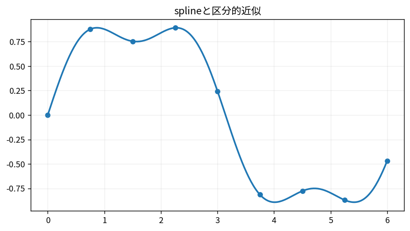

# splineと区分的近似

Course 05｜数値計算｜Topic 06/20

---
layout: center
---

## 今回の問い

## 到達目標

- 定義と代表式を、自分の言葉と記号で説明できる。
- 成立条件を確認し、手計算と結果を検算できる。

## 理解確認

- 定義・条件・計算結果を自分の言葉で説明できるか確認する。

splineと区分的近似の代表式は、どの定義・仮定から、なぜその形になるのか。

---

## なぜ今これを学ぶのか

前Topic `num-polynomial-interpolation` で得た概念を使い、ここでは splineと区分的近似 へ進む。

---

## 直感

補間は与えられた点を通る近似関数を構成し、区間内の値を推定する。

---

## 図解

同じ点に高次多項式と区分的splineを当て、振動の違いを見る。 点は必ず通るという制約を保ちながら、1本の高次多項式と区分的低次多項式では点間の振る舞いが異なる。端での振動は「点を通る」ことと「安定に近似する」ことが別である例である。

---

## 記号と代表式

- $x_i$：knot
- $s_i(x)$：区間 $[x_i,x_{i+1}]$ のcubic
- $s,s^{\prime},s^{\prime\prime}$：通常連続に接続

$$
s_i(x)=a_i+b_i(x-x_i)+c_i(x-x_i)^2+d_i(x-x_i)^3
$$

---

## 導出 1

m区間なら4m未知数。各区間の両端値条件で2m、内部knotの一階・二階連続で2(m-1)条件。

---

## 導出 2

合計4m-2条件なので2条件不足。natural splineなら両端二階導関数0などboundary conditionを足す。

---

## 例題

3点を2区間cubicで結ぶと、値一致に加え中間knotで傾き・曲率を一致させる。

---

## 条件を変えるとどうなるか

boundary条件を指定せず「cubic spline」とだけ言うと解が一意でない。natural, clamped等を区別する。

---

## よくある誤解

splineと区分的近似では、式へ数値を代入するだけでは不十分である。boundary条件を指定せず「cubic spline」とだけ言うと解が一意でない。natural, clamped等を区別する。 という失敗例が示すように、式を使える条件と結論の範囲を区別する必要がある。

---

## 実装・計算上の注意

scipy splineのbc_typeとextrapolation挙動を確認。データnoiseがある場合はinterpolating splineよりsmoothing splineが適切なこともある。

---

## 一段先へ

補間多項式を使って微分・積分を近似すると数値微分・求積法へつながる。

---

## 自分で説明できるか

- 「各区間4係数」を式を見ずに説明できるか
- 「局所性」までの論理を一段ずつ再現できるか
- splineと区分的近似の条件を1つ外した反例を説明できるか

---
layout: center
---

## 教科書と演習

- [教科書](../../textbook/num-splines-piecewise-approximation)
- [10問の演習](../../exercises/num-splines-piecewise-approximation)
