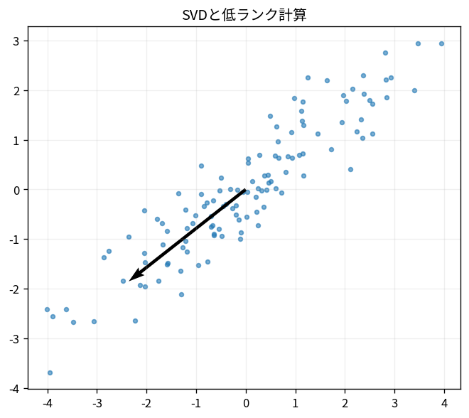

# SVDと低ランク計算

Course 05｜数値計算｜Topic 14/20

---
layout: center
---

## 今回の問い

## 到達目標

- 定義と代表式を、自分の言葉と記号で説明できる。
- 成立条件を確認し、手計算と結果を検算できる。

## 理解確認

- 定義・条件・計算結果を自分の言葉で説明できるか確認する。

SVDと低ランク計算の代表式は、どの定義・仮定から、なぜその形になるのか。

---

## なぜ今これを学ぶのか

前Topic `num-eigenvalue-power-qr` で得た概念を使い、ここでは SVDと低ランク計算 へ進む。

---

## 直感

低ランク近似はデータの主要な方向だけ残し、情報を圧縮する。

---

## 図解

行列画像を特異値1個、2個、…と増やして再構成する。 特異値を大きい順に並べると、各rank-1成分がデータをどれだけ強く説明するかが見える。小さい特異値の成分を落とすと低rank近似になる。

---

## 記号と代表式

- $A=U\Sigma V^T$
- $\sigma_1\ge\cdots$
- $A_r=U_r\Sigma_rV_r^T$：rank-r truncation

$$
\mathbf{A}_r=\mathbf{U}_r\mathbf{\Sigma}_r\mathbf{V}_r^{\mathsf T}
$$

---

## 導出 1

$A=\sum_i\sigma_i u_i v_i^T$。各rank-1成分は入力v_i方向を出力u_i方向へσ_i倍する。

---

## 導出 2

$A_r=\sum_{i=1}^r\sigma_i u_i v_i^T$。残差は残した以外の直交rank-1成分。

---

## 例題

singular values (10,3,0.2)ならrank2 truncationのspectral error0.2、Frobenius error0.2。

---

## 条件を変えるとどうなるか

truncated SVDが全目的で最良とは限らない。非負制約、sparse解釈、特定entry重み付き誤差では別factorizationが適切。

---

## よくある誤解

SVDと低ランク計算では、式へ数値を代入するだけでは不十分である。truncated SVDが全目的で最良とは限らない。非負制約、sparse解釈、特定entry重み付き誤差では別factorizationが適切。 という失敗例が示すように、式を使える条件と結論の範囲を区別する必要がある。

---

## 実装・計算上の注意

full SVDは高cost。rが小さいならLanczos/randomized SVDを使い、residual/subspace errorを検証する。

---

## 一段先へ

小singular value方向でinverseが誤差を増幅するため、truncationやridgeをinverse problemのregularizationとして使う。

---

## 自分で説明できるか

- 「SVD sum形」を式を見ずに説明できるか
- 「誤差」までの論理を一段ずつ再現できるか
- SVDと低ランク計算の条件を1つ外した反例を説明できるか

---
layout: center
---

## 教科書と演習

- [教科書](../../textbook/num-svd-low-rank-computation)
- [10問の演習](../../exercises/num-svd-low-rank-computation)
