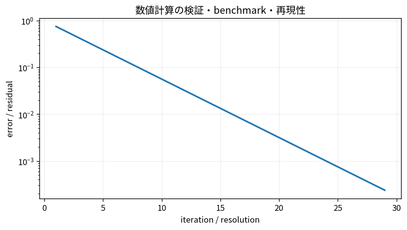

# 数値計算の検証・benchmark・再現性

Course 05｜数値計算｜Topic 20/20

---
layout: center
---

## 今回の問い

## 到達目標

- 定義と代表式を、自分の言葉と記号で説明できる。
- 成立条件を確認し、手計算と結果を検算できる。

## 理解確認

- 定義・条件・計算結果を自分の言葉で説明できるか確認する。

数値計算の検証・benchmark・再現性の代表式は、どの定義・仮定から、なぜその形になるのか。

---

## なぜ今これを学ぶのか

前Topic `num-monte-carlo-methods` で得た概念を使い、ここでは 数値計算の検証・benchmark・再現性 へ進む。

---

## 直感

反復法では誤差e_kが何乗の速さで小さくなるかと、どこで止めるかを分けて考える。

---

## 図解

線形収束・二次収束の誤差曲線を比較する。 横軸が反復回数、縦軸が誤差である。直線的な減少と急激な減少の違いは、誤差更新式e_{k+1}≈C e_k^pの指数pの違いに対応する。

---

## 記号と代表式

- $E(h)$：grid/step hでのerror
- $p$：理論収束次数
- $C$：leading constant
- $T(n)$：runtime/memory等

$$
E(h)\approx Ch^p
$$

---

## 導出 1

$E(h)=Ch^p$, $E(h/2)=C(h/2)^p$。比は $E(h)/E(h/2)=2^p$。

---

## 導出 2

$p\approx\log_2(E(h)/E(h/2))$。複数hでasymptotic regimeを確認する。

---

## 例題

E(h)=1e-2, E(h/2)=2.5e-3なら比4なのでobserved p=2。二次法の期待と一致。

---

## 条件を変えるとどうなるか

単一input・単一machineのruntime1回だけではbenchmarkにならない。warm-up、variance、thread数、BLAS、hardwareを記録する。

---

## よくある誤解

数値計算の検証・benchmark・再現性では、式へ数値を代入するだけでは不十分である。単一input・単一machineのruntime1回だけではbenchmarkにならない。warm-up、variance、thread数、BLAS、hardwareを記録する。 という失敗例が示すように、式を使える条件と結論の範囲を区別する必要がある。

---

## 実装・計算上の注意

environment lock、seed、dtype、tolerance、version、hardwareをmanifestへ残す。reference implementationとproperty testを併用する。

---

## 一段先へ

この検証文化はCourse06以降のoptimization/MLでも同じ。lossが下がるだけでなくoptimality residualやheld-out metricを検証する。

---

## 自分で説明できるか

- 「2つの解像度を比較」を式を見ずに説明できるか
- 「benchmarkを分離」までの論理を一段ずつ再現できるか
- 数値計算の検証・benchmark・再現性の条件を1つ外した反例を説明できるか

---
layout: center
---

## 教科書と演習

- [教科書](../../textbook/num-verification-benchmarking-reproducibility)
- [10問の演習](../../exercises/num-verification-benchmarking-reproducibility)
