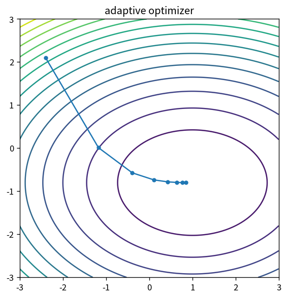

# adaptive optimizer

Course 06｜最適化｜Topic 18/20

---
layout: center
---

## 今回の問い

## 到達目標

- 定義と代表式を、自分の言葉と記号で説明できる。
- 成立条件を確認し、手計算と結果を検算できる。

## 理解確認

- 定義・条件・計算結果を自分の言葉で説明できるか確認する。

adaptive optimizerの代表式は、どの定義・仮定から、なぜその形になるのか。

---

## なぜ今これを学ぶのか

前Topic `opt-stochastic-gradient` で得た概念を使い、ここでは adaptive optimizer へ進む。

---

## 直感

確率的最適化は全データ勾配の代わりにノイズを含む推定勾配を使い、計算量と分散を交換する。

---

## 図解

full gradientとmini-batch軌跡を比較する。 full gradientの滑らかな軌跡に対しmini-batch gradientは揺らぐが、期待的には同じ下降方向を推定する。学習率は進む速さとノイズ平均化の両方を制御する。

---

## 記号と代表式

- $m_k$：gradientのfirst moment EMA
- $v_k$：squared gradient EMA
- $\beta_1,\beta_2$
- $\varepsilon$：zero division防止

$$
\mathbf{x}_{k+1}=\mathbf{x}_k-\eta\frac{\hat{\mathbf{m}}_k}{\sqrt{\hat{\mathbf{v}}_k}+\varepsilon}
$$

---

## 導出 1

$m_k=(1-β_1)\sum_{i=1}^kβ_1^{k-i}g_i$。重み総和は $1-β_1^k<1$ なのでstationary meanに対し0方向bias。

---

## 導出 2

$\hat m_k=m_k/(1-β_1^k)$、vも同様。

---

## 例題

gradient scaleが100倍異なる2座標でplain GDは単一η調整が難しいがadaptive scalingはeffective stepを近づける。

---

## 条件を変えるとどうなるか

Adamは全problemでSGDよりgeneralization/収束が良いわけではない。hyperparameterとobjective geometryに依存。

---

## よくある誤解

adaptive optimizerでは、式へ数値を代入するだけでは不十分である。Adamは全problemでSGDよりgeneralization/収束が良いわけではない。hyperparameterとobjective geometryに依存。 という失敗例が示すように、式を使える条件と結論の範囲を区別する必要がある。

---

## 実装・計算上の注意

epsilon placement、AMSGrad、decoupled weight decayなどframework差を確認。optimizer stateもcheckpoint対象。

---

## 一段先へ

目的が複数blockへ分離できる場合、ADMMのoperator splittingで各subproblemを別々に解く。

---

## 自分で説明できるか

- 「EMA expectationの初期bias」を式を見ずに説明できるか
- 「scale-normalized step」までの論理を一段ずつ再現できるか
- adaptive optimizerの条件を1つ外した反例を説明できるか

---
layout: center
---

## 教科書と演習

- [教科書](../../textbook/opt-adaptive-optimizers)
- [10問の演習](../../exercises/opt-adaptive-optimizers)
