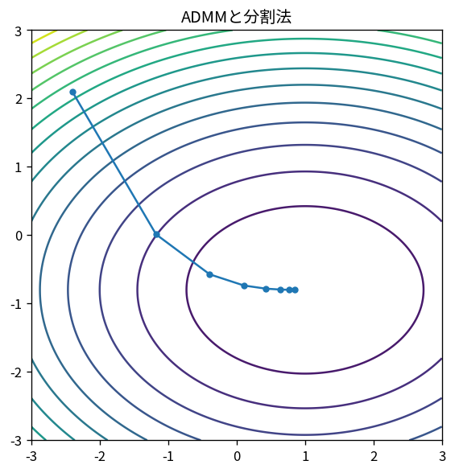

# ADMMと分割法

Course 06｜最適化｜Topic 19/20

---
layout: center
---

## 今回の問い

## 到達目標

- 定義と代表式を、自分の言葉と記号で説明できる。
- 成立条件を確認し、手計算と結果を検算できる。

## 理解確認

- 定義・条件・計算結果を自分の言葉で説明できるか確認する。

ADMMと分割法の代表式は、どの定義・仮定から、なぜその形になるのか。

---

## なぜ今これを学ぶのか

前Topic `opt-adaptive-optimizers` で得た概念を使い、ここでは ADMMと分割法 へ進む。

---

## 直感

近接法は非滑らかな項を直接微分せず、近接写像で「縮める」操作として扱う。

---

## 図解

L1近接写像のsoft-thresholdingを入力値ごとに描く。 gradient step後の点をそのまま採用せず、正則化項を含むproximal subproblemで近い点へ戻す。L1なら成分ごとのsoft-thresholdingとして0へ吸着する。

---

## 記号と代表式

- $f(x)+g(z)$
- $Ax+Bz=c$
- $\rho>0$：penalty
- $u$：scaled dual variable

$$
\min f(\mathbf{x})+g(\mathbf{z})\quad\text{s.t. }\mathbf{A}\mathbf{x}+\mathbf{B}\mathbf{z}=\mathbf{c}
$$

---

## 導出 1

難しい一問題をx側fとz側gに分け、等式constraintで一致させる。

---

## 導出 2

Lagrangianに $\frac\rho2\|Ax+Bz-c\|²$ を足し、primal violationへcurvatureを与える。

---

## 例題

Lassoでx=z constraintに分けるとx-stepはleast squares、z-stepはsoft-thresholdingに分離できる。

---

## 条件を変えるとどうなるか

nonconvex/不適切ρでは標準convex ADMM収束保証が使えない。subproblemを不正確に解く影響もある。

---

## よくある誤解

ADMMと分割法では、式へ数値を代入するだけでは不十分である。nonconvex/不適切ρでは標準convex ADMM収束保証が使えない。subproblemを不正確に解く影響もある。 という失敗例が示すように、式を使える条件と結論の範囲を区別する必要がある。

---

## 実装・計算上の注意

primal residual r=Ax+Bz-c と dual residualを別々にmonitorしρをadaptive調整することがある。

---

## 一段先へ

最後に、convex guaranteeのない現実のnonconvex problemで何を診断し、hyperparameter outer loopと分けるか整理する。

---

## 自分で説明できるか

- 「variable split」を式を見ずに説明できるか
- 「交互update」までの論理を一段ずつ再現できるか
- ADMMと分割法の条件を1つ外した反例を説明できるか

---
layout: center
---

## 教科書と演習

- [教科書](../../textbook/opt-admm-splitting)
- [10問の演習](../../exercises/opt-admm-splitting)
