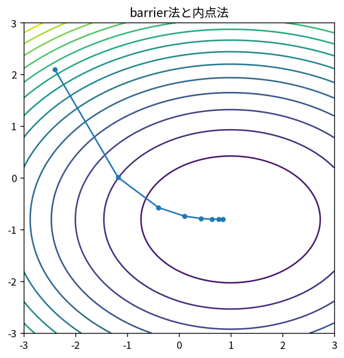

# barrier法と内点法

Course 06｜最適化｜Topic 14/20

---
layout: center
---

## 今回の問い

## 到達目標

- 定義と代表式を、自分の言葉と記号で説明できる。
- 成立条件を確認し、手計算と結果を検算できる。

## 理解確認

- 定義・条件・計算結果を自分の言葉で説明できるか確認する。

barrier法と内点法の代表式は、どの定義・仮定から、なぜその形になるのか。

---

## なぜ今これを学ぶのか

前Topic `opt-projected-gradient` で得た概念を使い、ここでは barrier法と内点法 へ進む。

---

## 直感

制約付き最適化では自由に動ける方向が限定され、最適点で目的勾配と制約の法線が釣り合う。

---

## 図解

等高線と制約曲線、接点を描く。 制約境界上の接線方向では目的関数を一次的に改善できない。そのため目的gradientは境界の法線、すなわち制約gradientの線形結合になる。

---

## 記号と代表式

- $g_i(x)<0$：strict interior
- $\phi(x)=-\sum\log(-g_i(x))$
- $t$：objective/barrier tradeoff parameter

$$
\phi(\mathbf{x})=-\sum_i\log(-g_i(\mathbf{x}))
$$

---

## 導出 1

$g_i(x)\uparrow0^-$ なら $-\log(-g_i)\to\infty$。infeasible側ではlog未定義。

---

## 導出 2

barrier optimumのstationarityから multiplierを $λ_i=1/(-t g_i)$ と読め、$λ_i(-g_i)=1/t$。t→∞でcomplementarity0へ近づく。

---

## 例題

minimize x subject x>0ではbarrier tx-log x。derivative t-1/x=0からx=1/t、t↑で境界optimum0へ近づく。

---

## 条件を変えるとどうなるか

初期strict feasible pointがない/見つけにくい場合はphase-Iが必要。barrier objective1回だけではexact constrained solutionでない。

---

## よくある誤解

barrier法と内点法では、式へ数値を代入するだけでは不十分である。初期strict feasible pointがない/見つけにくい場合はphase-Iが必要。barrier objective1回だけではexact constrained solutionでない。 という失敗例が示すように、式を使える条件と結論の範囲を区別する必要がある。

---

## 実装・計算上の注意

Newton system solveが主要cost。primal/dual residualとduality gapでstop。

---

## 一段先へ

barrierのmultiplier解釈からLagrange dualityを体系化する。

---

## 自分で説明できるか

- 「boundaryで発散」を式を見ずに説明できるか
- 「central path」までの論理を一段ずつ再現できるか
- barrier法と内点法の条件を1つ外した反例を説明できるか

---
layout: center
---

## 教科書と演習

- [教科書](../../textbook/opt-barrier-interior-point)
- [10問の演習](../../exercises/opt-barrier-interior-point)
