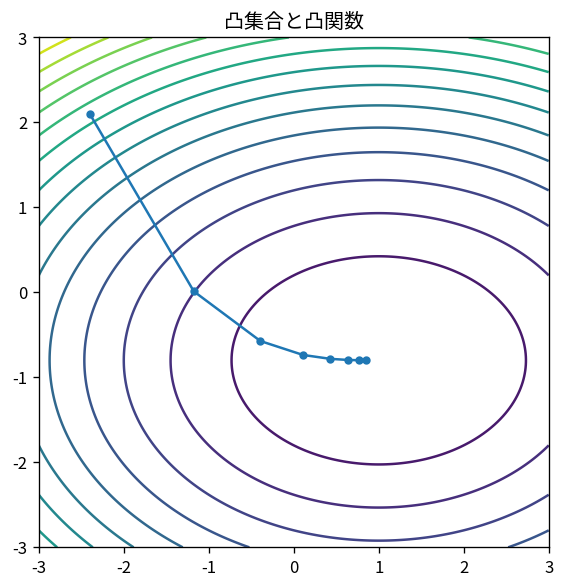

# 凸集合と凸関数

Course 06｜最適化｜Topic 02/20

---
layout: center
---

## 今回の問い

## 到達目標

- 定義と代表式を、自分の言葉と記号で説明できる。
- 成立条件を確認し、手計算と結果を検算できる。

## 理解確認

- 定義・条件・計算結果を自分の言葉で説明できるか確認する。

凸集合と凸関数の代表式は、どの定義・仮定から、なぜその形になるのか。

---

## なぜ今これを学ぶのか

前Topic `opt-problem-formulation-objectives-constraints` で得た概念を使い、ここでは 凸集合と凸関数 へ進む。

---

## 直感

凸性があると局所最小が大域最小になり、最適化の幾何が大幅に単純になる。

---

## 図解

2点を結ぶ線分と関数グラフを描き、chordより下にある条件を見る。 2点を結ぶ線分全体が集合内に残るのが凸集合である。関数では2点を結ぶchordよりgraphが上へ出ないことがJensen型不等式に対応する。

---

## 記号と代表式

- $\theta\in[0,1]$
- $\theta x+(1-\theta)y$：2点を結ぶ線分上の点
- $\mathcal C$：convex set
- $f$：convex function

$$
f(\theta\mathbf{x}+(1-\theta)\mathbf{y})\le\theta f(\mathbf{x})+(1-\theta)f(\mathbf{y})
$$

---

## 導出 1

θ=0でy、θ=1でx、その間がstraight segment。これを全て含むことが凸集合。

---

## 導出 2

epigraph $\{(x,t):t\ge f(x)\}$ がconvexであることとf convexは同値。chordよりgraphが下という幾何になる。

---

## 例題

quadratic f(x)=x²はconvex。second derivative2>0。line segment inequalityも平方完成で確認できる。

---

## 条件を変えるとどうなるか

constraintの各式がlinearでも「≠」やdiscrete constraintを入れるとfeasible setが非convexになることがある。

---

## よくある誤解

凸集合と凸関数では、式へ数値を代入するだけでは不十分である。constraintの各式がlinearでも「≠」やdiscrete constraintを入れるとfeasible setが非convexになることがある。 という失敗例が示すように、式を使える条件と結論の範囲を区別する必要がある。

---

## 実装・計算上の注意

CVX/DCPはcomposition ruleでconvexityを機械検証する。solverが「local optimum」と返す非convex problemとconvex guaranteeを区別。

---

## 一段先へ

convexityだけでなくsmoothnessとstrong convexityを入れるとgradient methodのrateを定量化できる。

---

## 自分で説明できるか

- 「線分のparameterization」を式を見ずに説明できるか
- 「local minimumがglobal」までの論理を一段ずつ再現できるか
- 凸集合と凸関数の条件を1つ外した反例を説明できるか

---
layout: center
---

## 教科書と演習

- [教科書](../../textbook/opt-convex-sets-functions)
- [10問の演習](../../exercises/opt-convex-sets-functions)
