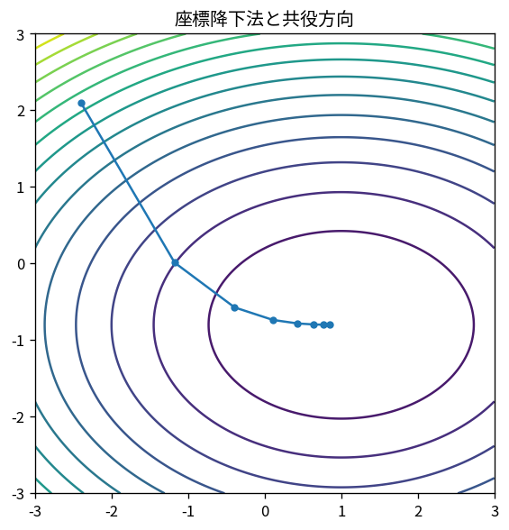

# 座標降下法と共役方向

Course 06｜最適化｜Topic 10/20

---
layout: center
---

## 今回の問い

## 到達目標

- 定義と代表式を、自分の言葉と記号で説明できる。
- 成立条件を確認し、手計算と結果を検算できる。

## 理解確認

- 定義・条件・計算結果を自分の言葉で説明できるか確認する。

座標降下法と共役方向の代表式は、どの定義・仮定から、なぜその形になるのか。

---

## なぜ今これを学ぶのか

前Topic `opt-trust-region-methods` で得た概念を使い、ここでは 座標降下法と共役方向 へ進む。

---

## 直感

一階法は局所の傾きを使って下降方向を作り、step sizeが一歩の大きさを決める。

---

## 図解

楕円等高線上で勾配降下の軌跡を追う。 楕円等高線に垂直な矢印がgradient、その反対向きが局所的な最急降下方向である。軌跡がジグザグするのは方向ごとの曲率が異なるためである。

---

## 記号と代表式

- $x_j$：第j座標
- coordinate descent：他座標固定で1座標最適化
- conjugate directions：$p_i^TAp_j=0$

$$
x_j\leftarrow\arg\min_z f(x_1,\ldots,z,\ldots,x_n)
$$

---

## 導出 1

現在xでj以外固定し、$\phi(z)=f(x_1,...,z,...,x_n)$ を最小化。

---

## 導出 2

$f=\frac12x^TAx-b^Tx$。方向p_iとp_jがA-conjugateなら二次交差項 $p_i^TAp_j$ が0。

---

## 例題

Lassoでは1座標subproblemがsoft-thresholding closed formになるためcoordinate descentが効率的。

---

## 条件を変えるとどうなるか

強くcoupledな座標でnaive coordinate descentはzig-zagし遅い。座標scale/orderも影響。

---

## よくある誤解

座標降下法と共役方向では、式へ数値を代入するだけでは不十分である。強くcoupledな座標でnaive coordinate descentはzig-zagし遅い。座標scale/orderも影響。 という失敗例が示すように、式を使える条件と結論の範囲を区別する必要がある。

---

## 実装・計算上の注意

random/cyclic/greedy coordinate selection、block sizeを測る。sparse featuresではupdateを局所化できる。

---

## 一段先へ

ここまでunconstrained中心。次にequality constraintをLagrange multiplier/KKTで扱う。

---

## 自分で説明できるか

- 「coordinate subproblem」を式を見ずに説明できるか
- 「CGへの接続」までの論理を一段ずつ再現できるか
- 座標降下法と共役方向の条件を1つ外した反例を説明できるか

---
layout: center
---

## 教科書と演習

- [教科書](../../textbook/opt-coordinate-conjugate-directions)
- [10問の演習](../../exercises/opt-coordinate-conjugate-directions)
