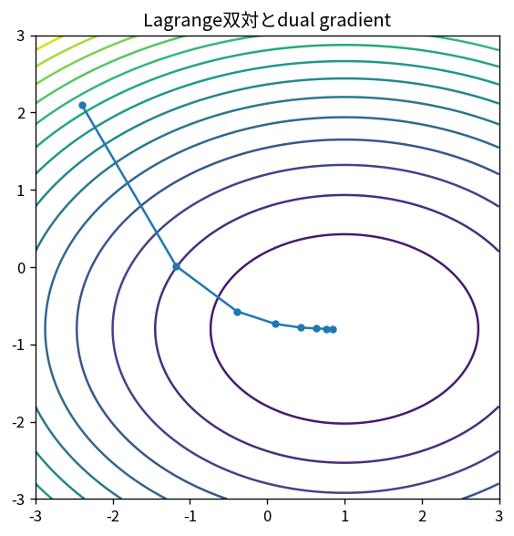

# Lagrange双対とdual gradient

Course 06｜最適化｜Topic 15/20

---
layout: center
---

## 今回の問い

## 到達目標

- 定義と代表式を、自分の言葉と記号で説明できる。
- 成立条件を確認し、手計算と結果を検算できる。

## 理解確認

- 定義・条件・計算結果を自分の言葉で説明できるか確認する。

Lagrange双対とdual gradientの代表式は、どの定義・仮定から、なぜその形になるのか。

---

## なぜ今これを学ぶのか

前Topic `opt-barrier-interior-point` で得た概念を使い、ここでは Lagrange双対とdual gradient へ進む。

---

## 直感

双対問題は制約違反へ価格を付け、元問題の下界を与える別の最適化問題を作る。

---

## 図解

primal値とdual値のgapを棒で比較する。 primalの実行可能点から得る上界/下界と、dual変数から得る境界値の間のgapを描く。強双対では最適点でこのgapが0になる。

---

## 記号と代表式

- $\mathcal L(x,λ)=f(x)+λ^Tg(x)$
- $q(λ)=\inf_x\mathcal L(x,λ)$：dual function
- $p^*$：primal optimum
- $d^*$：dual optimum

$$
g(\boldsymbol{\lambda})=\inf_{\mathbf{x}}\mathcal{L}(\mathbf{x},\boldsymbol{\lambda})
$$

---

## 導出 1

feasible xでg_i(x)≤0, λ_i≥0なのでλ^Tg≤0、よってL(x,λ)≤f(x)。さらにq(λ)=inf_x L≤L(x,λ)≤f(x)。

---

## 導出 2

λを選んでq(λ)を最大化すれば最も強いlower bound。これがdual problem。

---

## 例題

簡単なquadratic+linear constraintでdualを解析し、primal solutionと同じobjectiveを得るとstrong dualityを確認できる。

---

## 条件を変えるとどうなるか

nonconvexではduality gapがpositiveになり得る。dual optimumだけからprimal exact solutionを保証しない。

---

## よくある誤解

Lagrange双対とdual gradientでは、式へ数値を代入するだけでは不十分である。nonconvexではduality gapがpositiveになり得る。dual optimumだけからprimal exact solutionを保証しない。 という失敗例が示すように、式を使える条件と結論の範囲を区別する必要がある。

---

## 実装・計算上の注意

dual gradient/subgradientではinner inf solve accuracyも影響。primal recoveryとfeasibilityを別監視。

---

## 一段先へ

nonsmooth regularizerを分離して扱うproximal operatorはdualityとも深く関係するが、まずproximal gradientを構成する。

---

## 自分で説明できるか

- 「lower bound」を式を見ずに説明できるか
- 「gap」までの論理を一段ずつ再現できるか
- Lagrange双対とdual gradientの条件を1つ外した反例を説明できるか

---
layout: center
---

## 教科書と演習

- [教科書](../../textbook/opt-duality-dual-gradient)
- [10問の演習](../../exercises/opt-duality-dual-gradient)
