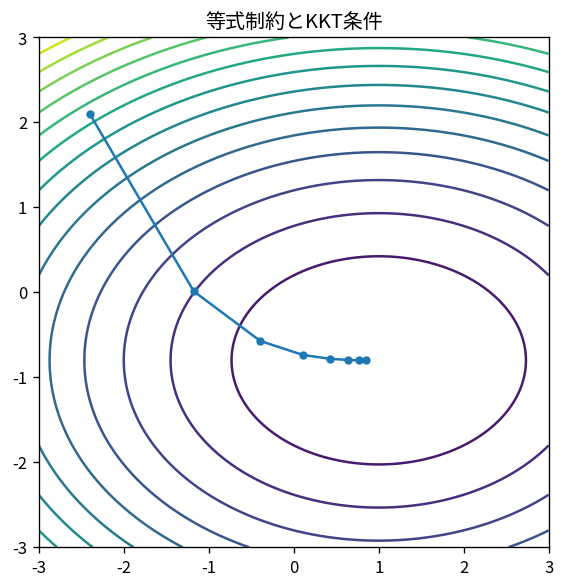

# 等式制約とKKT条件

Course 06｜最適化｜Topic 11/20

---
layout: center
---

## 今回の問い

## 到達目標

- 定義と代表式を、自分の言葉と記号で説明できる。
- 成立条件を確認し、手計算と結果を検算できる。

## 理解確認

- 定義・条件・計算結果を自分の言葉で説明できるか確認する。

等式制約とKKT条件の代表式は、どの定義・仮定から、なぜその形になるのか。

---

## なぜ今これを学ぶのか

前Topic `opt-coordinate-conjugate-directions` で得た概念を使い、ここでは 等式制約とKKT条件 へ進む。

---

## 直感

制約付き最適化では自由に動ける方向が限定され、最適点で目的勾配と制約の法線が釣り合う。

---

## 図解

等高線と制約曲線、接点を描く。 制約境界上の接線方向では目的関数を一次的に改善できない。そのため目的gradientは境界の法線、すなわち制約gradientの線形結合になる。

---

## 記号と代表式

- $g(x)=0$：m本の等式制約
- $J_g\in\mathbb R^{m\times n}$：constraint Jacobian
- $\lambda\in\mathbb R^m$：multipliers
- $\mathcal L=f+\lambda^Tg$

$$
\nabla f(\mathbf{x})+\mathbf{J}_g(\mathbf{x})^{\mathsf T}\boldsymbol{\lambda}=\mathbf{0}
$$

---

## 導出 1

constraint curve x(t)でg(x(t))=0を微分すると $J_g d=0$。feasible first-order direction dはnull(Jg)。

---

## 導出 2

全feasible tangent dに対し $\nabla f^Td=0$。つまり∇fはnull(Jg)のorthogonal complement。

---

## 例題

$f=x²+y²$, constraint x+y=1。stationarity (2x,2y)+λ(1,1)=0からx=y、制約で1/2ずつ。

---

## 条件を変えるとどうなるか

constraint gradientがzero/rank deficientだとregularityが壊れ、multiplier存在/一意性の標準議論が使えない。

---

## よくある誤解

等式制約とKKT条件では、式へ数値を代入するだけでは不十分である。constraint gradientがzero/rank deficientだとregularityが壊れ、multiplier存在/一意性の標準議論が使えない。 という失敗例が示すように、式を使える条件と結論の範囲を区別する必要がある。

---

## 実装・計算上の注意

KKT matrixはindefinite。generic SPD solverを使わずappropriate factorization/Schur complementを選ぶ。

---

## 一段先へ

inequalityではactiveかinactiveかが未知になり、multiplier非負性とcomplementarityが追加される。

---

## 自分で説明できるか

- 「feasible tangent」を式を見ずに説明できるか
- 「fundamental subspace relation」までの論理を一段ずつ再現できるか
- 等式制約とKKT条件の条件を1つ外した反例を説明できるか

---
layout: center
---

## 教科書と演習

- [教科書](../../textbook/opt-equality-constrained-kkt)
- [10問の演習](../../exercises/opt-equality-constrained-kkt)
