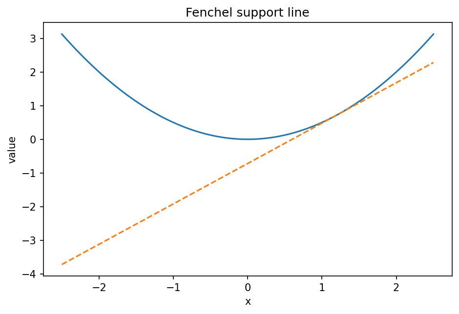

# Fenchel共役とFenchel双対

Course 06｜最適化

---

## 何を解決するか

関数を傾き空間へ写すFenchel共役が、なぜ双対問題と正則化の理解に役立つか。

共役 f*(y) は「傾きyを持つ線形関数がfからどれだけ上へ離れられるか」の最大値。Fenchel–Young不等式を通じてprimalとdualを結ぶ。

---

## 図の意味

凸関数 $f(x)=x^2/2$ と、その下に接する傾きyの直線を描く。$yx-f(x)$ の最大値は、傾きyを固定したとき直線をどこまで上へ持ち上げられるかを測り、その高さが $f^*(y)$。接点では $y\in\partial f(x)$。

---

## 記号

| 記号 | 意味 |
|---|---|
| $f*$ | Fenchel共役 |
| $x$ | primal変数 |
| $y$ | dual変数 |

- $f^*$：fのFenchel conjugate。
- $x$：primal variable、$y$：dual slope。
- $\sup$：上限（達成されない場合もある）。

---

## 中心式

$$
f^*(y)=\sup_x\{y^Tx-f(x)\}
$$

---

## 導出

1. 定義から任意x,yについて y^Tx-f(x)≤f*(y)。
2. 並べ替えて f(x)+f*(y)≥x^Ty (Fenchel–Young)。
3. 等号条件 y∈∂f(x) がprimal-dual最適性を与える。

---

## 省略しない一段

定義 $f^*(y)=\sup_x(y^Tx-f(x))$ から任意xについて $y^Tx-f(x)\le f^*(y)$、すなわちFenchel–Young $f(x)+f^*(y)\ge x^Ty$。

等号はxがsupremumを達成する条件 $0\in\partial_x[f(x)-y^Tx]$、すなわち $y\in\partial f(x)$ と一致する。smooth strict convexなら $y=\nabla f(x)$ と $x=\nabla f^*(y)$ が双対座標変換になる。

---

## 手計算

**問題**：$f(x)=|x|$ のFenchel共役を求めよ。

**解答**：$f^*(y)=\sup_x(yx-|x|)$。$|y|\le1$ なら $yx\le|x|$ なのでsup=0（x=0で達成）。$|y|>1$ なら符号を合わせて|x|→∞とすると無限大。したがって $f^*(y)=0$ for $|y|\le1$, $+\infty$ otherwise。

---

## 条件を変える

$f(x)=x^2/2$ では $yx-x^2/2$ をxで最大化。微分 $y-x=0$ からx=y、値は $y^2/2$。したがって $f^*(y)=y^2/2$。

---

## どこで壊れるか

supremumが有限とは限らない。$f(x)=0$ for all x ならy≠0で $yx$ は無限に大きくでき、$f^*(y)=+\infty$。extended-real-valued convex functionとして扱う理由である。

---

## 次へ

Lagrange duality、regularization、exponential family、mirror descentに現れる。entropyの共役がlog-sum-expになる関係はsoftmaxとも直結する。

---

[教科書](../../textbook/opt-fenchel-duality-conjugates)　|　[10問の演習](../../exercises/opt-fenchel-duality-conjugates)
