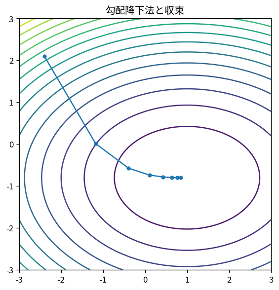

# 勾配降下法と収束

Course 06｜最適化｜Topic 06/20

---
layout: center
---

## 今回の問い

## 到達目標

- 定義と代表式を、自分の言葉と記号で説明できる。
- 成立条件を確認し、手計算と結果を検算できる。

## 理解確認

- 定義・条件・計算結果を自分の言葉で説明できるか確認する。

勾配降下法と収束の代表式は、どの定義・仮定から、なぜその形になるのか。

---

## なぜ今これを学ぶのか

前Topic `opt-line-search-step-size` で得た概念を使い、ここでは 勾配降下法と収束 へ進む。

---

## 直感

一階法は局所の傾きを使って下降方向を作り、step sizeが一歩の大きさを決める。

---

## 図解

楕円等高線上で勾配降下の軌跡を追う。 楕円等高線に垂直な矢印がgradient、その反対向きが局所的な最急降下方向である。軌跡がジグザグするのは方向ごとの曲率が異なるためである。

---

## 記号と代表式

- $x_{k+1}=x_k-\eta_k\nabla f(x_k)$
- $\eta_k$：learning rate
- $L$：smoothness
- $\mu$：strong convexity

$$
\mathbf{x}_{k+1}=\mathbf{x}_k-\eta_k\nabla f(\mathbf{x}_k)
$$

---

## 導出 1

unit pで一次変化は∇f^Tp。Cauchy–Schwarzより最小はp=-∇f/||∇f||。

---

## 導出 2

$f(x-ηg)\le f(x)-η||g||²+\frac L2η²||g||²$。η≤1/Lなら少なくとも $η/2||g||²$ 下がる。

---

## 例題

$f(x)=\frac12ax²$。更新x_{k+1}=(1-ηa)x_k。収束条件は|1-ηa|<1、すなわち0<η<2/a。

---

## 条件を変えるとどうなるか

ηが2/L以上だと簡単なquadraticでもoscillate/diverge。gradient方向が正しくてもstepで失敗する。

---

## よくある誤解

勾配降下法と収束では、式へ数値を代入するだけでは不十分である。ηが2/L以上だと簡単なquadraticでもoscillate/diverge。gradient方向が正しくてもstepで失敗する。 という失敗例が示すように、式を使える条件と結論の範囲を区別する必要がある。

---

## 実装・計算上の注意

lossだけでなくgradient norm、validation、step sizeをlog。floating-pointで「lossが完全単調」を必須にしないoptimizerもある。

---

## 一段先へ

past gradientsを利用してvalley方向のoscillationを抑えるmomentum/accelerated methodsへ。

---

## 自分で説明できるか

- 「directionの導出」を式を見ずに説明できるか
- 「strong convex rate」までの論理を一段ずつ再現できるか
- 勾配降下法と収束の条件を1つ外した反例を説明できるか

---
layout: center
---

## 教科書と演習

- [教科書](../../textbook/opt-gradient-descent-convergence)
- [10問の演習](../../exercises/opt-gradient-descent-convergence)
