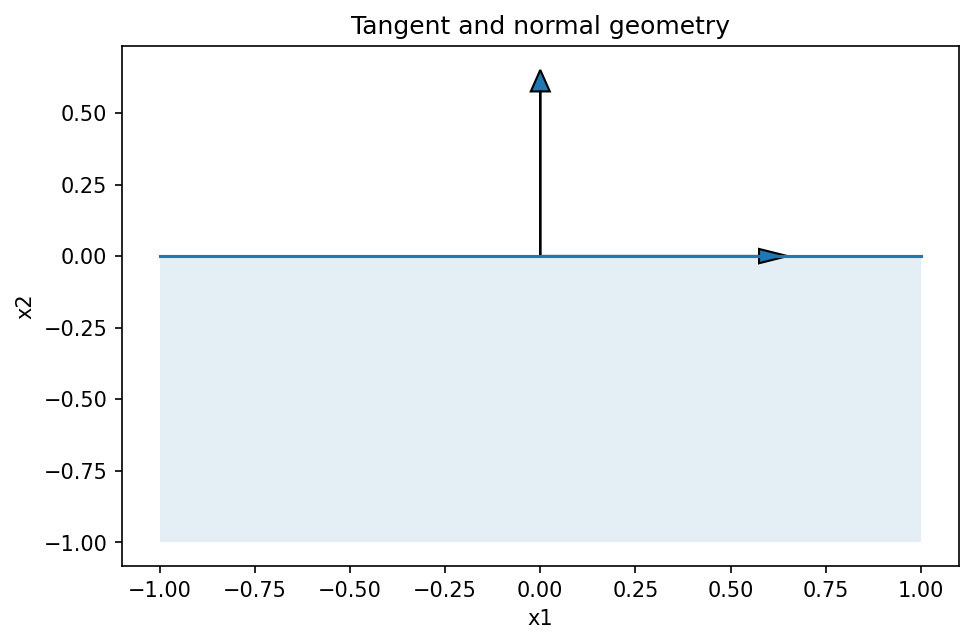

# 不等式制約・相補性・KKT

Course 06｜最適化

---

## 今回の問い

KKT条件を公式として暗記せず、feasible directionとnormal coneからどう導くか。

---

## 直感

最適点では実行可能な一次方向へ目的を下げられない。したがって負の目的勾配はfeasible tangent coneのpolarであるnormal coneに入る。CQの下でnormal coneをactive constraint gradientの非負結合として表すとKKTになる。

---

## 図解

---

## 中心式

$$
\nabla f(x^*)+\sum_i\lambda_i\nabla g_i(x^*)=0,\quad \lambda_i g_i(x^*)=0
$$

---

## 導出

1. 局所最小では全feasible direction dに対し∇f^T d≥0。
2. よって-∇f∈N_C。
3. LICQ/Slater等の適切な条件下でactive constraintのgradientがnormal coneを生成する。
4. inactive constraintはg_i<0なので局所境界を作らずλ_i=0。activeではg_i=0でλ_i≥0が可能。

---

## 小さい例

min (x-2)² s.t. x≤1。x*=1、f′=-2、g′=1なので -2+λ=0→λ=2。x≤3ならx*=2はinactiveでλ=0。

---

## 条件を外すと

- CQ failureではKKTが必要条件にならない場合がある。
- 非凸ではKKTだけでglobal optimalityを保証しない。

---

## 理解確認

- 式の各記号を定義できるか。
- 導出を1段ずつ再現できるか。
- 反例を1つ作れるか。

---

## 教科書と演習

[教科書](../../textbook/opt-inequality-constraints-kkt)

[10問の演習](../../exercises/opt-inequality-constraints-kkt)
