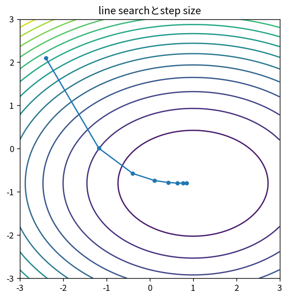

# line searchとstep size

Course 06｜最適化｜Topic 05/20

---
layout: center
---

## 今回の問い

## 到達目標

- 定義と代表式を、自分の言葉と記号で説明できる。
- 成立条件を確認し、手計算と結果を検算できる。

## 理解確認

- 定義・条件・計算結果を自分の言葉で説明できるか確認する。

line searchとstep sizeの代表式は、どの定義・仮定から、なぜその形になるのか。

---

## なぜ今これを学ぶのか

前Topic `opt-optimality-conditions` で得た概念を使い、ここでは line searchとstep size へ進む。

---

## 直感

一階法は局所の傾きを使って下降方向を作り、step sizeが一歩の大きさを決める。

---

## 図解

楕円等高線上で勾配降下の軌跡を追う。 楕円等高線に垂直な矢印がgradient、その反対向きが局所的な最急降下方向である。軌跡がジグザグするのは方向ごとの曲率が異なるためである。

---

## 記号と代表式

- $\mathbf p$：search direction
- $\alpha>0$：step size
- $c_1\in(0,1)$：Armijo parameter

$$
f(\mathbf{x}+\alpha\mathbf{p})\le f(\mathbf{x})+c_1\alpha\nabla f(\mathbf{x})^{\mathsf T}\mathbf{p}
$$

---

## 導出 1

$f(x+\alpha p)\approx f(x)+\alpha\nabla f(x)^Tp$。descent directionなら内積<0。

---

## 導出 2

高次項があるので予測通り全部下がる必要はない。$f(x+αp)\le f(x)+c_1α∇f^Tp$ を要求。

---

## 例題

quadraticでsteepest descent p=-g。αが大きすぎるとvalleyを飛び越え、backtrackingが安定なstepへ縮める。

---

## 条件を変えるとどうなるか

pがdescent directionでない（g^Tp≥0）ならαを小さくしてもArmijoの意味ある下降を保証できない。

---

## よくある誤解

line searchとstep sizeでは、式へ数値を代入するだけでは不十分である。pがdescent directionでない（g^Tp≥0）ならαを小さくしてもArmijoの意味ある下降を保証できない。 という失敗例が示すように、式を使える条件と結論の範囲を区別する必要がある。

---

## 実装・計算上の注意

NaN region, bound constraintsがある場合trial step validityも確認。function evaluation countをbenchmarkに含める。

---

## 一段先へ

step size ruleを得た上でgradient descentの収束rateを導く。

---

## 自分で説明できるか

- 「一次予測」を式を見ずに説明できるか
- 「backtracking」までの論理を一段ずつ再現できるか
- line searchとstep sizeの条件を1つ外した反例を説明できるか

---
layout: center
---

## 教科書と演習

- [教科書](../../textbook/opt-line-search-step-size)
- [10問の演習](../../exercises/opt-line-search-step-size)
