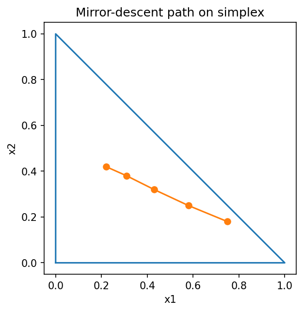

# Mirror descentとBregman divergence

Course 06｜最適化

---

## 何を解決するか

Euclidean距離が自然でない確率simplexなどで、勾配法のgeometryをどう変えるか。

mirror descentは、現在点近傍をEuclidean二乗距離で罰する代わりに、strictly convexなmirror mapが作るBregman divergenceを使う。

---

## 図の意味

三角形が2次元probability simplex $x_1,x_2\ge0$, $x_1+x_2\le1$。点列は境界を越えずに内部を曲がって進む。Euclideanで真っ直ぐ投影するのではなく、選んだmirror mapが作るgeometryで「近さ」を測って更新することを示す。

---

## 記号

| 記号 | 意味 |
|---|---|
| $ψ$ | mirror map |
| $D_ψ(x,y)$ | Bregman divergence |
| $η$ | step size |

- $C$：feasible convex set。
- $\psi$：strictly convex mirror function。
- $D_\psi(x,y)$：Bregman divergence。
- $\eta>0$：step size。

---

## 中心式

$$
x_{t+1}=\arg\min_{x\in C}\{\eta\nabla f(x_t)^Tx+D_\psi(x,x_t)\}
$$

---

## 導出

1. 勾配で目的を一次近似する。
2. 動きすぎをDψで罰する。
3. ψ=||x||²/2ならDψ=||x-y||²/2となりprojected gradientへ戻る。

---

## 省略しない一段

Bregman divergenceはstrictly convex differentiable $\psi$ から $D_\psi(x,y)=\psi(x)-\psi(y)-\nabla\psi(y)^T(x-y)$。凸性により非負だが、一般に対称でもtriangle inequalityを満たす距離でもない。

mirror descentは目的を $f(x_t)+\nabla f(x_t)^T(x-x_t)$ と一次近似し、前点から離れるpenaltyをEuclidean二乗距離ではなく $D_\psi(x,x_t)$ にする。$\psi=\|x\|^2/2$ なら通常のprojected gradient。negative entropyならsimplexに自然なmultiplicative updateが出る。

---

## 手計算

**問題**：$\psi(x)=\tfrac12\|x\|_2^2$ のBregman divergenceが $\tfrac12\|x-y\|_2^2$ になることを展開して示せ。

**解答**：$D_\psi(x,y)=\tfrac12\|x\|^2-\tfrac12\|y\|^2-y^T(x-y)=\tfrac12\|x\|^2+\tfrac12\|y\|^2-y^Tx=\tfrac12\|x-y\|^2$。

---

## 条件を変える

simplex上で $\psi(x)=\sum_i x_i\log x_i$ を使うと、一階条件から $x_{t+1,i}\propto x_{t,i}e^{-\eta g_i}$。正値性を保ち、最後に総和1へ正規化する。

---

## どこで壊れるか

Bregman divergenceを普通のmetricだと思って $D(x,y)=D(y,x)$ を使わない。またmirror mapのdomain境界でgradientが発散する場合があるため、初期点とdomainを確認する。

---

## 次へ

exponentiated gradient、online learning、natural gradientと関係する。確率分布・positive coneなどEuclidean座標が不自然な問題でgeometry選択が重要になる。

---

[教科書](../../textbook/opt-mirror-descent-bregman)　|　[10問の演習](../../exercises/opt-mirror-descent-bregman)

---

## 今回の問い

「Mirror descentとBregman divergence」は何を表し、どの条件で使え、結果をどう検算するのか？

---

## 到達目標

- Euclidean距離が自然でない確率simplexなどで、勾配法のgeometryをどう変えるか。
- 中心式の記号と成立条件を説明できる
- 小さい例と反例で検算できる

---

## 理解確認

1. Euclidean距離が自然でない確率simplexなどで、勾配法のgeometryをどう変えるか。
2. 中心式の記号と成立条件を説明できる
3. 小さい例と反例で検算できる
