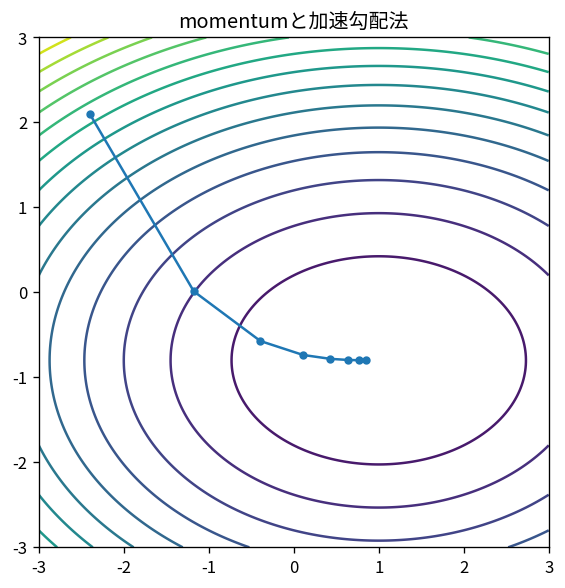

# momentumと加速勾配法

Course 06｜最適化｜Topic 07/20

---
layout: center
---

## 今回の問い

## 到達目標

- 定義と代表式を、自分の言葉と記号で説明できる。
- 成立条件を確認し、手計算と結果を検算できる。

## 理解確認

- 定義・条件・計算結果を自分の言葉で説明できるか確認する。

momentumと加速勾配法の代表式は、どの定義・仮定から、なぜその形になるのか。

---

## なぜ今これを学ぶのか

前Topic `opt-gradient-descent-convergence` で得た概念を使い、ここでは momentumと加速勾配法 へ進む。

---

## 直感

一階法は局所の傾きを使って下降方向を作り、step sizeが一歩の大きさを決める。

---

## 図解

楕円等高線上で勾配降下の軌跡を追う。 楕円等高線に垂直な矢印がgradient、その反対向きが局所的な最急降下方向である。軌跡がジグザグするのは方向ごとの曲率が異なるためである。

---

## 記号と代表式

- $v_k$：蓄積direction/momentum
- $\beta\in[0,1)$：memory係数
- $\eta$：step

$$
\mathbf{v}_{k+1}=\beta\mathbf{v}_k+\nabla f(\mathbf{x}_k)
$$

---

## 導出 1

$v_{k+1}=\beta v_k+g_k$ を展開すると $v_{k+1}=g_k+\beta g_{k-1}+\beta²g_{k-2}+\cdots$。

---

## 導出 2

急曲率方向でgradient符号が交互なら過去項と相殺、緩い方向で同符号なら蓄積。

---

## 例題

細長いquadratic valleyでplain GDが左右にzig-zagするのに対しmomentumは横成分を減衰し谷方向へ速度を蓄える。

---

## 条件を変えるとどうなるか

momentumは常に速くなるわけではない。nonstationary/noisy gradientや不適切η,βでoscillation/divergence。

---

## よくある誤解

momentumと加速勾配法では、式へ数値を代入するだけでは不十分である。momentumは常に速くなるわけではない。nonstationary/noisy gradientや不適切η,βでoscillation/divergence。 という失敗例が示すように、式を使える条件と結論の範囲を区別する必要がある。

---

## 実装・計算上の注意

frameworkごとにmomentum式（classical/Nesterov）の定義が異なる。hyperparameter意味をdocumentationで確認。

---

## 一段先へ

一階情報に加えcurvatureを直接使うNewton法なら局所でさらに速い収束が可能。

---

## 自分で説明できるか

- 「指数平均として展開」を式を見ずに説明できるか
- 「accelerationの注意」までの論理を一段ずつ再現できるか
- momentumと加速勾配法の条件を1つ外した反例を説明できるか

---
layout: center
---

## 教科書と演習

- [教科書](../../textbook/opt-momentum-accelerated-gradient)
- [10問の演習](../../exercises/opt-momentum-accelerated-gradient)
