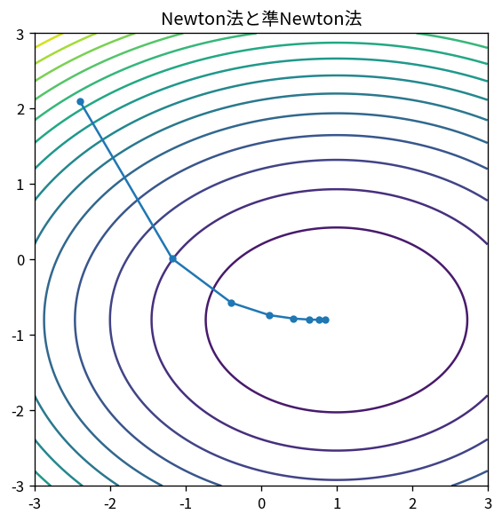

# Newton法と準Newton法

Course 06｜最適化｜Topic 08/20

---
layout: center
---

## 今回の問い

## 到達目標

- 定義と代表式を、自分の言葉と記号で説明できる。
- 成立条件を確認し、手計算と結果を検算できる。

## 理解確認

- 定義・条件・計算結果を自分の言葉で説明できるか確認する。

Newton法と準Newton法の代表式は、どの定義・仮定から、なぜその形になるのか。

---

## なぜ今これを学ぶのか

前Topic `opt-momentum-accelerated-gradient` で得た概念を使い、ここでは Newton法と準Newton法 へ進む。

---

## 直感

二階法は勾配だけでなく曲率を使い、局所二次モデルを解いて進行方向と距離を決める。

---

## 図解

同じ二次関数で勾配法とNewton法の軌跡を比較する。 二次近似の楕円はHessianが決める局所曲率を表す。Newton stepはgradientだけでなくこの楕円の伸びを補正して、二次モデルの最小点へ直接向かう。

---

## 記号と代表式

- $g=\nabla f(x)$
- $H=\nabla²f(x)$：Hessian
- $p$：Newton step

$$
\mathbf{x}_{k+1}=\mathbf{x}_k-\mathbf{H}_f(\mathbf{x}_k)^{-1}\nabla f(\mathbf{x}_k)
$$

---

## 導出 1

$f(x+p)\approx f(x)+g^Tp+\frac12p^THp$。

---

## 導出 2

$\nabla_p m=g+Hp$（H symmetric）。0と置き $Hp=-g$。

---

## 例題

$f(x)=\frac12x^TAx-b^Tx$ ではH=A一定。Newton stepはAx=bを一回解くのでexact minimizerへ1step。

---

## 条件を変えるとどうなるか

nonconvexでHがindefiniteならNewton directionがdescentでない。line search/trust region/dampingが必要。

---

## よくある誤解

Newton法と準Newton法では、式へ数値を代入するだけでは不十分である。nonconvexでHがindefiniteならNewton directionがdescentでない。line search/trust region/dampingが必要。 という失敗例が示すように、式を使える条件と結論の範囲を区別する必要がある。

---

## 実装・計算上の注意

H inverseを作らずsolve。大規模ではHessian-vector product + CG、L-BFGS。

---

## 一段先へ

二次modelを「どこまで信用するか」を明示するtrust regionへ。

---

## 自分で説明できるか

- 「二次model」を式を見ずに説明できるか
- 「なぜinverseを明示しないか」までの論理を一段ずつ再現できるか
- Newton法と準Newton法の条件を1つ外した反例を説明できるか

---
layout: center
---

## 教科書と演習

- [教科書](../../textbook/opt-newton-quasi-newton)
- [10問の演習](../../exercises/opt-newton-quasi-newton)
