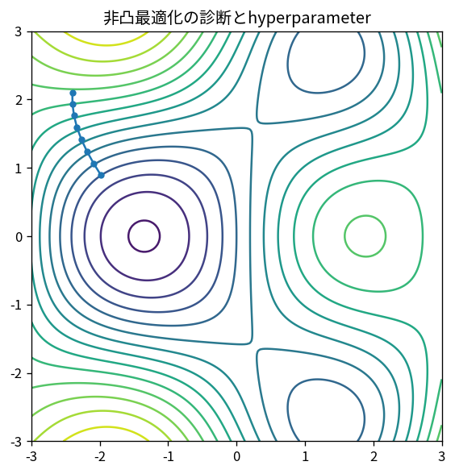

# 非凸最適化の診断とhyperparameter

Course 06｜最適化｜Topic 20/20

---
layout: center
---

## 今回の問い

## 到達目標

- 定義と代表式を、自分の言葉と記号で説明できる。
- 成立条件を確認し、手計算と結果を検算できる。

## 理解確認

- 定義・条件・計算結果を自分の言葉で説明できるか確認する。

非凸最適化の診断とhyperparameterの代表式は、どの定義・仮定から、なぜその形になるのか。

---

## なぜ今これを学ぶのか

前Topic `opt-admm-splitting` で得た概念を使い、ここでは 非凸最適化の診断とhyperparameter へ進む。

---

## 直感

非凸問題では局所最小・鞍点・平坦領域が共存し、単一の最終値だけでなく軌跡や初期値依存性を診断する。

---

## 図解

複数初期値から同じ目的関数を最適化し、到達点を比較する。 複数の谷・鞍点・平坦部が同じ等高線図に現れる。局所的な一階・二階条件だけでは大域最適性を保証できないことが形から分かる。

---

## 記号と代表式

- $w^*(\lambda)$：training optimizationで得るparameter
- $\lambda$：hyperparameter
- $L_{val}$：validation loss
- $\Lambda$：search space

$$
\min_{\lambda\in\Lambda}\;\mathcal{L}_{\mathrm{val}}(\mathbf{w}^{\ast}(\lambda))
$$

---

## 導出 1

inner: $w^*(λ)\approx argmin_w L_{train}(w;λ)$。outer: $min_λ L_{val}(w^*(λ);λ)$。

---

## 導出 2

λをtraining lossで選ぶとmodel complexityを増やす方向へ偏る。held-out validationがgeneralization proxy。

---

## 例題

learning rateが大きすぎてdivergeする場合と、train lossは低いがval loss悪化するoverfitは対策が異なる。

---

## 条件を変えるとどうなるか

test setでhyperparameterを何度も選ぶとtestがvalidation化し最終性能estimateがoptimistic。

---

## よくある誤解

非凸最適化の診断とhyperparameterでは、式へ数値を代入するだけでは不十分である。test setでhyperparameterを何度も選ぶとtestがvalidation化し最終性能estimateがoptimistic。 という失敗例が示すように、式を使える条件と結論の範囲を区別する必要がある。

---

## 実装・計算上の注意

experiment trackingでcode/data split/seed/optimizer/scheduleを固定記録。early stopping criterionもhyperparameter。

---

## 一段先へ

Course08ではこの最適化をmodel学習の内部要素として使い、data split・評価・model selectionをより体系化する。

---

## 自分で説明できるか

- 「二層problem」を式を見ずに説明できるか
- 「診断の分離」までの論理を一段ずつ再現できるか
- 非凸最適化の診断とhyperparameterの条件を1つ外した反例を説明できるか

---
layout: center
---

## 教科書と演習

- [教科書](../../textbook/opt-nonconvex-diagnostics-hyperparameters)
- [10問の演習](../../exercises/opt-nonconvex-diagnostics-hyperparameters)
