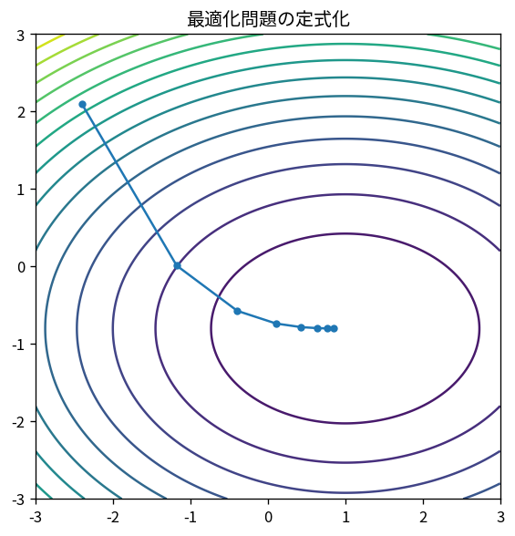

# 最適化問題の定式化

Course 06｜最適化｜Topic 01/20

---
layout: center
---

## 今回の問い

## 到達目標

- 定義と代表式を、自分の言葉と記号で説明できる。
- 成立条件を確認し、手計算と結果を検算できる。

## 理解確認

- 定義・条件・計算結果を自分の言葉で説明できるか確認する。

最適化問題の定式化の代表式は、どの定義・仮定から、なぜその形になるのか。

---

## なぜ今これを学ぶのか

Course 06 の入口として、最適化問題の定式化 を定義から組み立てる。

---

## 直感

最適化は「変えられる変数」「最小化したい目的」「守る制約」を分離して定義することから始まる。

---

## 図解

2変数目的関数の等高線上に実行可能領域を重ねる。 等高線は同じ目的関数値、塗られた領域は制約を満たす点である。最適解は実行可能領域の中で最も低い等高線が初めて接触する位置として読める。

---

## 記号と代表式

- $\mathbf x\in\mathbb R^n$：decision variable
- $f(\mathbf x)$：objective
- $\mathcal X$：feasible set
- $g_i(\mathbf x)\le0,h_j(\mathbf x)=0$：constraints

$$
\min_{\mathbf{x}\in\mathcal{X}} f(\mathbf{x})
$$

---

## 導出 1

制御量・parameter・配分量をvector xへまとめる。観測値やfixed constantはdecision variableに入れない。

---

## 導出 2

複数の望ましさを目的関数fへ写す。maximizeは符号を反転してminimizeへ統一できる。

---

## 例題

配分x1,x2≥0, x1+x2=100, cost=3x1+5x2を最小化。変数・制約・目的を分けるだけで「何を解くか」が明確。

---

## 条件を変えるとどうなるか

目的にvalidation metricを含めたままtest dataでtuningするとdata leakage。数学的定式化が正しくても情報flowの制約を破る。

---

## よくある誤解

最適化問題の定式化では、式へ数値を代入するだけでは不十分である。目的にvalidation metricを含めたままtest dataでtuningするとdata leakage。数学的定式化が正しくても情報flowの制約を破る。 という失敗例が示すように、式を使える条件と結論の範囲を区別する必要がある。

---

## 実装・計算上の注意

scaleの違うobjective項を足す場合、weightの単位と意味を記録。solverへ渡す前にfeasibility checkとgradient shapeをtestする。

---

## 一段先へ

次に、問題がconvexなら局所情報からglobal optimumを保証しやすくなるため、集合と関数のconvexityを定義する。

---

## 自分で説明できるか

- 「現実の選択を変数へ写す」を式を見ずに説明できるか
- 「許容条件を集合へ」までの論理を一段ずつ再現できるか
- 最適化問題の定式化の条件を1つ外した反例を説明できるか

---
layout: center
---

## 教科書と演習

- [教科書](../../textbook/opt-problem-formulation-objectives-constraints)
- [10問の演習](../../exercises/opt-problem-formulation-objectives-constraints)
