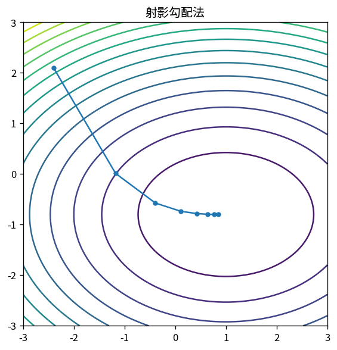

# 射影勾配法

Course 06｜最適化｜Topic 13/20

---
layout: center
---

## 今回の問い

## 到達目標

- 定義と代表式を、自分の言葉と記号で説明できる。
- 成立条件を確認し、手計算と結果を検算できる。

## 理解確認

- 定義・条件・計算結果を自分の言葉で説明できるか確認する。

射影勾配法の代表式は、どの定義・仮定から、なぜその形になるのか。

---

## なぜ今これを学ぶのか

前Topic `opt-inequality-constraints-kkt` で得た概念を使い、ここでは 射影勾配法 へ進む。

---

## 直感

制約付き最適化では自由に動ける方向が限定され、最適点で目的勾配と制約の法線が釣り合う。

---

## 図解

等高線と制約曲線、接点を描く。 制約境界上の接線方向では目的関数を一次的に改善できない。そのため目的gradientは境界の法線、すなわち制約gradientの線形結合になる。

---

## 記号と代表式

- $\mathcal C$：closed convex feasible set
- $\Pi_C(z)=\arg\min_{x\in C}\|x-z\|$
- $\eta$：step

$$
\mathbf{x}_{k+1}=\Pi_{\mathcal{C}}(\mathbf{x}_k-\eta\nabla f(\mathbf{x}_k))
$$

---

## 導出 1

$z=x_k-η∇f(x_k)$ はconstraintを無視した下降候補。

---

## 導出 2

$x_{k+1}=Π_C(z)$ でfeasibleへ戻す。convex closed Cではprojectionは一意。

---

## 例題

box constraint [0,1]^nならprojectionは各成分clip。

---

## 条件を変えるとどうなるか

nonconvex Cではnearest pointが複数になり、projection mapが不連続/algorithmがlocal trap。

---

## よくある誤解

射影勾配法では、式へ数値を代入するだけでは不十分である。nonconvex Cではnearest pointが複数になり、projection mapが不連続/algorithmがlocal trap。 という失敗例が示すように、式を使える条件と結論の範囲を区別する必要がある。

---

## 実装・計算上の注意

projection costがobjective gradientより高い場合もある。constraint-specific efficient projectionを利用。

---

## 一段先へ

projectionが難しいinequality制約はbarrierでinteriorから境界へ近づく方法がある。

---

## 自分で説明できるか

- 「gradient step」を式を見ずに説明できるか
- 「fixed point optimality」までの論理を一段ずつ再現できるか
- 射影勾配法の条件を1つ外した反例を説明できるか

---
layout: center
---

## 教科書と演習

- [教科書](../../textbook/opt-projected-gradient)
- [10問の演習](../../exercises/opt-projected-gradient)
