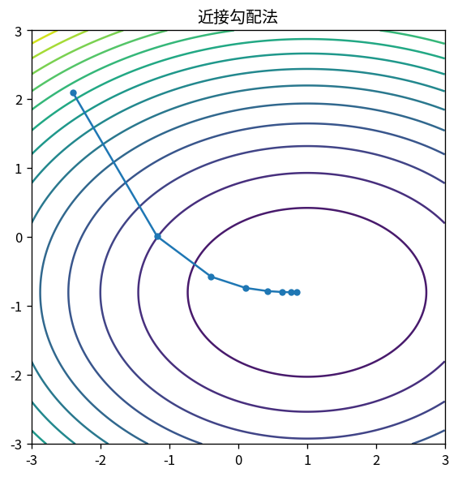

# 近接勾配法

Course 06｜最適化｜Topic 16/20

---
layout: center
---

## 今回の問い

## 到達目標

- 定義と代表式を、自分の言葉と記号で説明できる。
- 成立条件を確認し、手計算と結果を検算できる。

## 理解確認

- 定義・条件・計算結果を自分の言葉で説明できるか確認する。

近接勾配法の代表式は、どの定義・仮定から、なぜその形になるのか。

---

## なぜ今これを学ぶのか

前Topic `opt-duality-dual-gradient` で得た概念を使い、ここでは 近接勾配法 へ進む。

---

## 直感

近接法は非滑らかな項を直接微分せず、近接写像で「縮める」操作として扱う。

---

## 図解

L1近接写像のsoft-thresholdingを入力値ごとに描く。 gradient step後の点をそのまま採用せず、正則化項を含むproximal subproblemで近い点へ戻す。L1なら成分ごとのsoft-thresholdingとして0へ吸着する。

---

## 記号と代表式

- $F(x)=f(x)+g(x)$：smooth f + possibly nonsmooth g
- $prox_{ηg}(z)=argmin_x[g(x)+\frac1{2η}\|x-z\|²]$

$$
\mathbf{x}_{k+1}=\operatorname{prox}_{\eta g}(\mathbf{x}_k-\eta\nabla f(\mathbf{x}_k))
$$

---

## 導出 1

$f(x)\approx f(x_k)+∇f_k^T(x-x_k)+\frac1{2η}\|x-x_k\|²$。

---

## 導出 2

g(x)を加え、x依存部分をまとめると $g(x)+\frac1{2η}\|x-(x_k-η∇f_k)\|²$。

---

## 例題

g=λ||x||_1ならproxはsoft-thresholding。gradient step後に小さい成分をzeroへ縮めるISTA。

---

## 条件を変えるとどうなるか

gのproxが難しいと1stepがcheapとは限らない。分割が不適切なら利点を失う。

---

## よくある誤解

近接勾配法では、式へ数値を代入するだけでは不十分である。gのproxが難しいと1stepがcheapとは限らない。分割が不適切なら利点を失う。 という失敗例が示すように、式を使える条件と結論の範囲を区別する必要がある。

---

## 実装・計算上の注意

FISTA acceleration、backtracking、duality gapを利用。thresholdのλ/η conventionをlibraryで確認。

---

## 一段先へ

dataが巨大ならfull gradientをsample gradientへ置換するstochastic gradientへ。

---

## 自分で説明できるか

- 「fのquadratic upper model」を式を見ずに説明できるか
- 「prox update」までの論理を一段ずつ再現できるか
- 近接勾配法の条件を1つ外した反例を説明できるか

---
layout: center
---

## 教科書と演習

- [教科書](../../textbook/opt-proximal-gradient)
- [10問の演習](../../exercises/opt-proximal-gradient)
