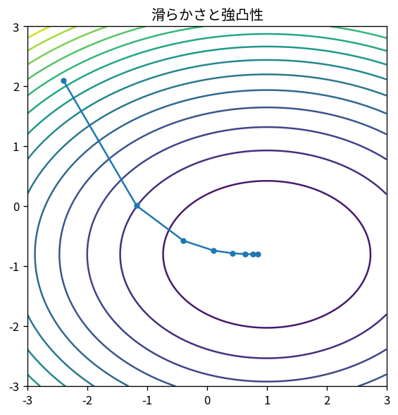

# 滑らかさと強凸性

Course 06｜最適化｜Topic 03/20

---
layout: center
---

## 今回の問い

## 到達目標

- 定義と代表式を、自分の言葉と記号で説明できる。
- 成立条件を確認し、手計算と結果を検算できる。

## 理解確認

- 定義・条件・計算結果を自分の言葉で説明できるか確認する。

滑らかさと強凸性の代表式は、どの定義・仮定から、なぜその形になるのか。

---

## なぜ今これを学ぶのか

前Topic `opt-convex-sets-functions` で得た概念を使い、ここでは 滑らかさと強凸性 へ進む。

---

## 直感

凸性があると局所最小が大域最小になり、最適化の幾何が大幅に単純になる。

---

## 図解

2点を結ぶ線分と関数グラフを描き、chordより下にある条件を見る。 2点を結ぶ線分全体が集合内に残るのが凸集合である。関数では2点を結ぶchordよりgraphが上へ出ないことがJensen型不等式に対応する。

---

## 記号と代表式

- $L$：gradient Lipschitz定数
- $\mu>0$：strong convexity定数
- $\nabla f$：gradient
- $\|\cdot\|_2$：Euclidean norm

$$
\frac{\mu}{2}\|\mathbf{x}-\mathbf{y}\|_2^2\le f(\mathbf{x})-f(\mathbf{y})-\nabla f(\mathbf{y})^{\mathsf T}(\mathbf{x}-\mathbf{y})
$$

---

## 導出 1

線分上でgradient変化を積分すると $f(x)\le f(y)+\nabla f(y)^T(x-y)+\frac L2\|x-y\|²$。

---

## 導出 2

$f(x)\ge f(y)+\nabla f(y)^T(x-y)+\frac\mu2\|x-y\|²$。

---

## 例題

$f(x)=\frac12x^TAx$ with SPD Aならμ=λmin(A), L=λmax(A)。

---

## 条件を変えるとどうなるか

convexとstrongly convexを同一視するとunique minimizerやlinear convergenceを誤って保証する。

---

## よくある誤解

滑らかさと強凸性では、式へ数値を代入するだけでは不十分である。convexとstrongly convexを同一視するとunique minimizerやlinear convergenceを誤って保証する。 という失敗例が示すように、式を使える条件と結論の範囲を区別する必要がある。

---

## 実装・計算上の注意

L,μを正確に知らない場合line searchやestimateを使う。feature scaling/preconditioningはeffective κを改善。

---

## 一段先へ

これらの定数を使い、stationary conditionとglobal optimalityを次に整理する。

---

## 自分で説明できるか

- 「smoothnessからupper quadratic bound」を式を見ずに説明できるか
- 「condition ratio」までの論理を一段ずつ再現できるか
- 滑らかさと強凸性の条件を1つ外した反例を説明できるか

---
layout: center
---

## 教科書と演習

- [教科書](../../textbook/opt-smoothness-strong-convexity)
- [10問の演習](../../exercises/opt-smoothness-strong-convexity)
