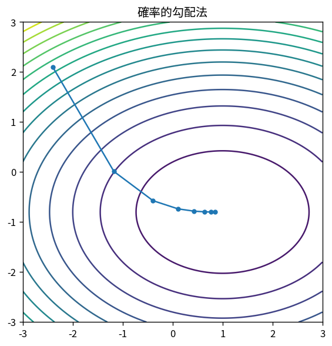

# 確率的勾配法

Course 06｜最適化｜Topic 17/20

---
layout: center
---

## 今回の問い

## 到達目標

- 定義と代表式を、自分の言葉と記号で説明できる。
- 成立条件を確認し、手計算と結果を検算できる。

## 理解確認

- 定義・条件・計算結果を自分の言葉で説明できるか確認する。

確率的勾配法の代表式は、どの定義・仮定から、なぜその形になるのか。

---

## なぜ今これを学ぶのか

前Topic `opt-proximal-gradient` で得た概念を使い、ここでは 確率的勾配法 へ進む。

---

## 直感

確率的最適化は全データ勾配の代わりにノイズを含む推定勾配を使い、計算量と分散を交換する。

---

## 図解

full gradientとmini-batch軌跡を比較する。 full gradientの滑らかな軌跡に対しmini-batch gradientは揺らぐが、期待的には同じ下降方向を推定する。学習率は進む速さとノイズ平均化の両方を制御する。

---

## 記号と代表式

- $f(x)=E_\xi[\ell(x;\xi)]$
- $\widehat{\nabla f}$：mini-batch gradient estimate
- $\eta_k$：learning rate

$$
\mathbf{x}_{k+1}=\mathbf{x}_k-\eta_k\widehat{\nabla f}(\mathbf{x}_k)
$$

---

## 導出 1

finite dataなら $∇f=(1/n)\sum_i∇\ell_i$。uniform sample iなら $E[∇\ell_i]=∇f$。

---

## 導出 2

$x_{k+1}=x_k-η_k g_k$。条件付き期待ではGD方向だが各stepはnoiseを含む。

---

## 例題

n=1e6でbatch100なら1stepはfull gradientの約1/10000 data。多くのcheap stepで早く有用解へ。

---

## 条件を変えるとどうなるか

1 sample gradientが常に下降方向とは限らない。1step loss増加を即bugと判断しない。

---

## よくある誤解

確率的勾配法では、式へ数値を代入するだけでは不十分である。1 sample gradientが常に下降方向とは限らない。1step loss増加を即bugと判断しない。 という失敗例が示すように、式を使える条件と結論の範囲を区別する必要がある。

---

## 実装・計算上の注意

shuffle、sampler、batch size、seed、learning-rate scheduleを再現性情報として残す。

---

## 一段先へ

gradientの一階・二階momentをonline推定してcoordinate-wise stepを変えるadaptive optimizerへ。

---

## 自分で説明できるか

- 「full gradient as expectation」を式を見ずに説明できるか
- 「noise floor」までの論理を一段ずつ再現できるか
- 確率的勾配法の条件を1つ外した反例を説明できるか

---
layout: center
---

## 教科書と演習

- [教科書](../../textbook/opt-stochastic-gradient)
- [10問の演習](../../exercises/opt-stochastic-gradient)
