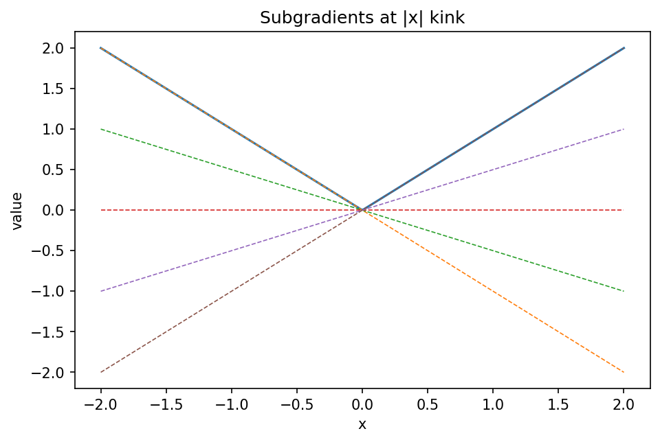

# 劣勾配と非滑らか最適化

Course 06｜最適化

---

## 何を解決するか

|x|やL1正則化のように微分できない点があっても、凸最適化をどう続けるか。

凸関数では接線の代わりに「関数を下から支える直線・超平面」の傾きを使える。その傾き集合がsubdifferential。

---

## 図の意味

V字型の $f(x)=|x|$ を描き、x=0で複数の支持直線を重ねる。傾きgが[-1,1]なら直線 $f(0)+g(x-0)=gx$ は常にV字の下側にあるので、これら全部が0でのsubgradient。微分不能だから「傾きがない」のではなく「許される支持傾きが集合になる」。

---

## 記号

| 記号 | 意味 |
|---|---|
| $f$ | 凸関数 |
| $g$ | 点xでの劣勾配 |
| $∂f(x)$ | 劣勾配全体の集合 |

- $f:\mathbb R^n\to\mathbb R\cup\{+\infty\}$：凸関数。
- $g$：subgradient。
- $\partial f(x)$：xでの全subgradient集合。

---

## 中心式

$$
g\in\partial f(x)\iff f(y)\ge f(x)+g^T(y-x)\;\forall y
$$

---

## 導出

1. 滑らかな凸関数の一次supporting inequalityを一般化する。
2. 微分不能点では1本の接線でなく複数のsupporting hyperplaneが存在し得る。
3. 0∈∂f(x*)なら全yで f(y)≥f(x*) なのでx*はglobal minimizer。

---

## 省略しない一段

凸関数で $g\in\partial f(x)$ とは全yに対し $f(y)\ge f(x)+g^T(y-x)$。微分可能なら凸性の一次条件から $\partial f(x)=\{\nabla f(x)\}$。非滑らかな点では集合が複数要素を持つ。

最適性条件 $0\in\partial f(x^*)$ は強力で、定義へg=0を代入すれば $f(y)\ge f(x^*)$ for all y。つまり凸問題ではglobal minimumを直接保証する。

---

## 手計算

**問題**：$f(x)=|x-2|$ の $x=2$ におけるsubdifferentialを求め、0が含まれることから最小点を確認せよ。

**解答**：$u=x-2$ と置けば $|u|$ の0でのsubdifferentialは[-1,1]。したがって $\partial f(2)=[-1,1]$。0を含むので凸最適性条件からx=2はglobal minimizer。

---

## 条件を変える

$f(x)=|x|+2x$。x>0でsubgradientは3、x<0で1、x=0で[-1,1]+2=[1,3]。0を含まないので0は最小ではなく、実際x→-∞でf→-∞となる。

---

## どこで壊れるか

subgradientは任意の「左右微分の中間値」ではない。非凸関数では凸subdifferentialの定義が空になることもあり、Clarke subgradient等別概念が必要。

---

## 次へ

L1正則化、hinge loss、proximal gradientへつながる。soft-thresholdingは $0\in$ smooth gradient + L1 subgradient から導ける。

---

[教科書](../../textbook/opt-subgradients-nonsmooth)　|　[10問の演習](../../exercises/opt-subgradients-nonsmooth)

---

## 今回の問い

「劣勾配と非滑らか最適化」は何を表し、どの条件で使え、結果をどう検算するのか？

---

## 到達目標

- |x|やL1正則化のように微分できない点があっても、凸最適化をどう続けるか。
- 中心式の記号と成立条件を説明できる
- 小さい例と反例で検算できる

---

## 理解確認

1. |x|やL1正則化のように微分できない点があっても、凸最適化をどう続けるか。
2. 中心式の記号と成立条件を説明できる
3. 小さい例と反例で検算できる
