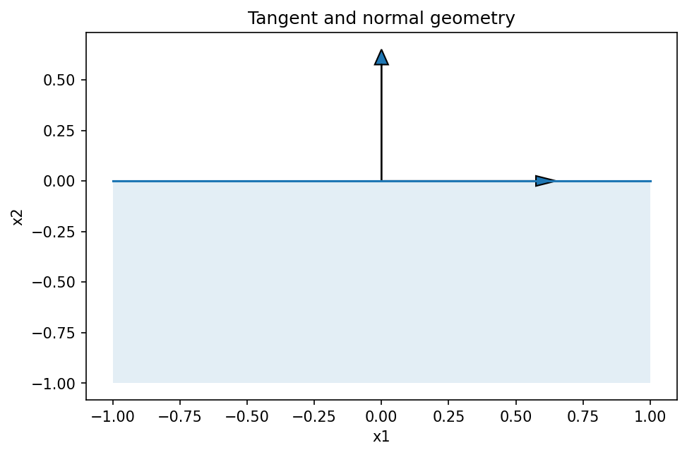

# 接錐・法錐・制約資格条件

Course 06｜最適化

---

## 今回の問い

KKTのstationarityは、なぜ「目的勾配と制約法線の釣り合い」になるのか。

---

## 直感

最適点から一次的に動ける方向の集合がtangent cone。その全方向へ目的関数を減らせない条件は、負の勾配がtangent coneの極coneであるnormal coneに入ること。KKTはnormal coneを制約勾配で表現した形。

---

## 図解

---

## 中心式

$$
-\nabla f(x^*)\in N_C(x^*)
$$

---

## 導出

1. feasible direction d では小さいt>0でx*+tdが許される。
2. 局所最小なら全feasible directionで ∇f(x*)^T d≥0。
3. これは -∇f(x*) が tangent cone のpolar、すなわちnormal coneに属することと同値。CQの下でnormal coneをactive constraint gradientで表せる。

---

## 小さい例

半空間 x≤1 の境界x=1ではfeasible directionはd≤0、normal coneは非負方向。目的勾配が左向きなら負勾配が右向きnormalに入る。

---

## 条件を外すと

- CQが壊れると制約勾配だけでnormal coneを表せない。
- KKT pointとglobal optimumを非凸問題で同一視しない。

---

## 理解確認

- 式の各記号を定義できるか。
- 導出を1段ずつ再現できるか。
- 反例を1つ作れるか。

---

## 教科書と演習

[教科書](../../textbook/opt-tangent-normal-cones-cq)

[10問の演習](../../exercises/opt-tangent-normal-cones-cq)
