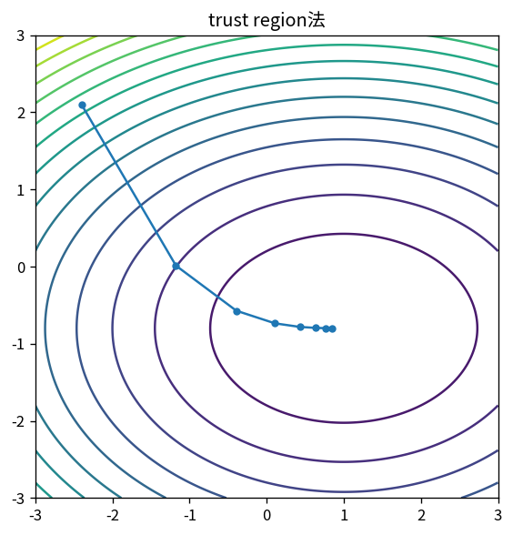

# trust region法

Course 06｜最適化｜Topic 09/20

---
layout: center
---

## 今回の問い

## 到達目標

- 定義と代表式を、自分の言葉と記号で説明できる。
- 成立条件を確認し、手計算と結果を検算できる。

## 理解確認

- 定義・条件・計算結果を自分の言葉で説明できるか確認する。

trust region法の代表式は、どの定義・仮定から、なぜその形になるのか。

---

## なぜ今これを学ぶのか

前Topic `opt-newton-quasi-newton` で得た概念を使い、ここでは trust region法 へ進む。

---

## 直感

二階法は勾配だけでなく曲率を使い、局所二次モデルを解いて進行方向と距離を決める。

---

## 図解

同じ二次関数で勾配法とNewton法の軌跡を比較する。 二次近似の楕円はHessianが決める局所曲率を表す。Newton stepはgradientだけでなくこの楕円の伸びを補正して、二次モデルの最小点へ直接向かう。

---

## 記号と代表式

- $m_k(p)$：local model
- $\Delta_k$：trust radius
- $\rho_k$：actual/predicted reduction比

$$
\min_{\|\mathbf{p}\|\le\Delta_k} m_k(\mathbf{p})
$$

---

## 導出 1

Taylor modelはpが小さいほど高次項が小さい。そこで||p||≤Δを課す。

---

## 導出 2

$\rho=(f(x)-f(x+p))/(m(0)-m(p))$。1に近ければmodelが当たり、負なら予測と逆。

---

## 例題

Newton stepが遠すぎると悪化するproblemでも、小さいtrust region内のCauchy stepから安全に進める。

---

## 条件を変えるとどうなるか

Δを固定して小さすぎると極端に遅い。大きすぎるとtrustという考えが失われる。

---

## よくある誤解

trust region法では、式へ数値を代入するだけでは不十分である。Δを固定して小さすぎると極端に遅い。大きすぎるとtrustという考えが失われる。 という失敗例が示すように、式を使える条件と結論の範囲を区別する必要がある。

---

## 実装・計算上の注意

subproblemをexactに解く必要はなくdogleg/truncated CG等。accept/rejectとradius logを残す。

---

## 一段先へ

coordinate/subspaceを限定して解く方法も「一度に探索する自由度を制限する」別アプローチ。

---

## 自分で説明できるか

- 「model誤差の局所性」を式を見ずに説明できるか
- 「radius update」までの論理を一段ずつ再現できるか
- trust region法の条件を1つ外した反例を説明できるか

---
layout: center
---

## 教科書と演習

- [教科書](../../textbook/opt-trust-region-methods)
- [10問の演習](../../exercises/opt-trust-region-methods)
