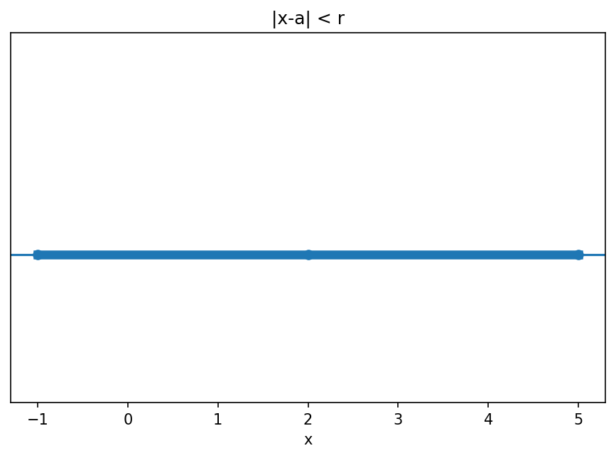

# 絶対値・不等式・区間

Course 00｜学習準備

---

## 今回の問い

絶対値を「場合分け」ではなく距離として読むと、不等式はどう整理できるか。

---

## 直感

|x-a| は実数直線上で x と a の距離。したがって |x-a|<r は「a から距離 r 未満」の区間を表す。極限の ε–δ 記法にもそのままつながる。

---

## 図解

---

## 中心式

$$
|x-a|<r\iff a-r<x<a+r
$$

---

## 導出

1. 絶対値を距離と読む。
2. 中心 a から左右に r だけ動いた境界が a-r, a+r。
3. 両境界の内側にある条件が二重不等式になる。

---

## 小さい例

|x-2|≤3 は -1≤x≤5。まず中心2、半径3を読むと符号ミスを減らせる。

---

## 条件を外すと

- 負数を掛けて不等号が反転する操作を忘れない。
- 開区間と閉区間を区別する。

---

## 理解確認

- 式の各記号を定義できるか。
- 導出を1段ずつ再現できるか。
- 反例を1つ作れるか。

---

## 教科書と演習

[教科書](../../textbook/prep-absolute-values-inequalities-intervals)

[10問の演習](../../exercises/prep-absolute-values-inequalities-intervals)
