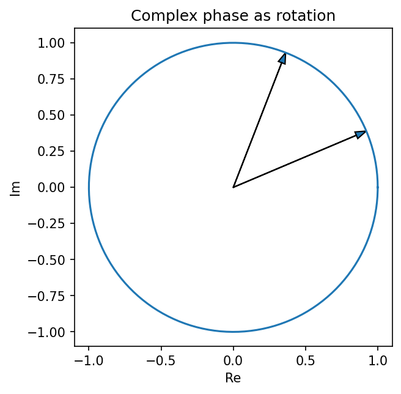

# 複素数・極形式・Euler公式

Course 00｜学習準備

---

## 何を解決するか

複素数の掛け算を、平面上の回転と拡大としてどう読むか。

複素数 z=a+bi は平面上のベクトルとみなせる。極形式では大きさ r と角度 θ に分け、掛け算が「大きさを掛け、角度を足す」操作になる。Fourier・固有値・振動の共通言語になる。

---

## 図の意味

複素平面の横軸は実部、縦軸は虚部。原点から $z$ への矢印の長さが $|z|=r$、正の実軸からの角度が $\theta$。単位円上の $e^{i\theta}$ を掛けると、長さは変えずに角度だけ $\theta$ 増えるため、図の2本の矢印は「同じ長さで回転した」関係になっている。

---

## 記号

| 記号 | 意味 |
|---|---|
| $i$ | i²=-1 を満たす虚数単位 |
| $r=|z|$ | 複素数の絶対値 |
| $θ=arg z$ | 偏角 |

- $i$：$i^2=-1$ を満たす虚数単位。
- $z=a+bi$：複素数。$a=\operatorname{Re}z$, $b=\operatorname{Im}z$。
- $r=|z|\ge0$, $\theta$：偏角。

---

## 中心式

$$
e^{i\theta}=\cos\theta+i\sin\theta
$$

---

## この段階で確認すること

1. 単位円上の角度 $\theta$ の点は $\cos\theta+i\sin\theta$。
2. 加法定理から、二つの単位複素数の積は角度を足した点になる。
3. この回転族を $e^{i\theta}$ と表す。Taylor級数からの解析的導出はCourse 01後半で行う。

---

## 乗法が回転になる計算

$$
(\cos\alpha+i\sin\alpha)(\cos\beta+i\sin\beta)
=\cos(\alpha+\beta)+i\sin(\alpha+\beta).
$$

したがって $r_1e^{i\alpha}\,r_2e^{i\beta}=r_1r_2e^{i(\alpha+\beta)}$。大きさは掛け、角度は足す。

---

## 手計算

**問題**：$z=2e^{i\pi/6}$ と $w=3e^{-i\pi/3}$ の積を極形式と直交形式の両方で求めよ。

**解答**：$zw=6e^{-i\pi/6}=6(\sqrt3/2-i/2)=3\sqrt3-3i$。倍率は2×3=6、角度は $\pi/6-\pi/3=-\pi/6$。

---

## 条件を変える

$(1+i)^2=1+2i+i^2=2i$。極形式では $1+i=\sqrt2 e^{i\pi/4}$ なので二乗は $2e^{i\pi/2}=2i$。直交座標計算と回転の解釈が一致する。

---

## どこで壊れるか

argument $\theta$ は一意ではなく $\theta+2\pi k$ も同じ複素数を表す。主値を使う場合は範囲を明示する。また $z=0$ では角度は定義できない。

---

## 次へ

Fourier変換では正弦・余弦を $e^{i\omega t}$ にまとめ、振幅と位相を同時に扱う。線形代数では実行列でも複素固有値が現れるため、この表現が後続Courseの共通言語になる。

---

[教科書](../../textbook/prep-complex-numbers-euler-form)　|　[10問の演習](../../exercises/prep-complex-numbers-euler-form)
