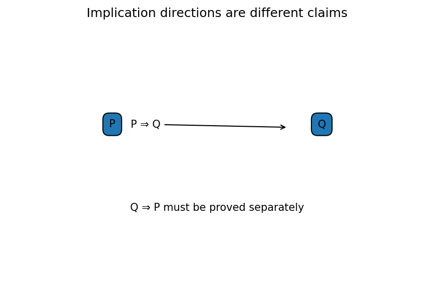

# 定義・命題・証明の読み方

Course 00｜学習準備

---

## 今回の問い

定義・定理・必要条件・十分条件を混同せず読むには何を確認するか。

---

## 直感

定義は用語の意味、定理は仮定から結論が従う主張。証明は仮定から論理規則で結論へ到達する過程。

---

## 図解

---

## 中心式

$$
P\Rightarrow Q\quad\text{と}\quad Q\Rightarrow P\text{は別の主張}
$$

---

## 導出

1. 命題の仮定Pと結論Qを分離する。
2. 証明がどちら向きの含意を示しているか確認する。
3. 同値には両方向の証明が必要。

---

## 小さい例

x=2ならx²=4は真だが、x²=4ならx=2は実数では偽（x=-2もある）。

---

## 条件を外すと

- 逆・裏・対偶を混同しない。

---

## 理解確認

- 式の各記号を定義できるか。
- 導出を1段ずつ再現できるか。
- 反例を1つ作れるか。

---

## 教科書と演習

[教科書](../../textbook/prep-definitions-theorems-proofs)

[10問の演習](../../exercises/prep-definitions-theorems-proofs)
