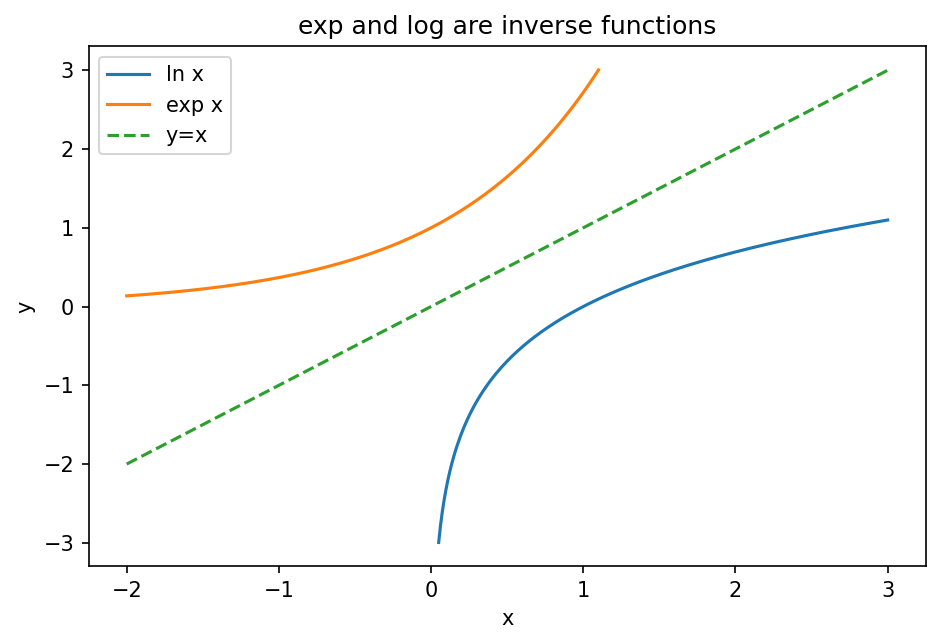

# 指数と対数

Course 00｜学習準備

---

## 何を身につけるか

指数法則と対数法則を、定義域の条件まで含めて使い、指数的な積を加法へ変換するにはどうするか。

---

## 図

指数関数 $y=e^x$ と自然対数 $y=\log x$ が直線 $y=x$ に関して鏡映になっている。これは互いが逆関数で、$\log(e^x)=x$、$e^{\log x}=x$（x>0）を図示する。

---

## 定義と理由

指数法則 $a^{x+y}=a^xa^y$, $(a^x)^y=a^{xy}$ は $a>0$ を基本にする。自然指数 $e^x$ の逆関数が自然対数 $\log x$ で、定義域はx>0。

対数法則 $\log(xy)=\log x+\log y$、$\log(x^p)=p\log x$ は正のx,yで成立する。対数は非常に大きな積を和へ変えるため、likelihoodの積をlog-likelihoodの和へ変える統計で特に重要。

---

## 具体例

$e^{2\log3}=e^{\log9}=9$。$\log(1/8)=\log 1-\log8=-3\log2$。

---

## ここで誤ると

$\log(x+y)=\log x+\log y$ は一般に偽。x=y=1なら左辺はlog2、右辺は0。

---

## 次へ

微積分の指数・対数微分、確率のlog-likelihood、softmax/log-sum-expへ接続。

---

[教科書](../../textbook/prep-exponents-logarithms)　|　[演習](../../exercises/prep-exponents-logarithms)
