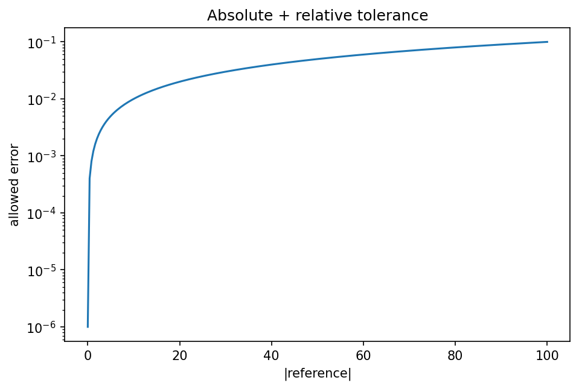

# 数値検算と再現性

Course 00｜学習準備

---

## 今回の問い

「コードが動いた」から「計算が正しい」へ進むため、何を記録・検算するか。

---

## 直感

再現性はseedだけではない。入力、version、dtype、tolerance、algorithm、environmentを記録し、小さい既知例・極端例・invariantで検算する。

---

## 図解

---

## 中心式

$$
|x-\hat x|\le \varepsilon_{abs}+\varepsilon_{rel}|x|
$$

---

## 導出

1. exact equalityが不適切な浮動小数点比較を避ける。
2. scaleが小さい領域はabsolute tolerance、大きい領域はrelative toleranceで扱う。
3. expected invariantやreference solutionと併用する。

---

## 小さい例

0.1+0.2を0.3と==比較するよりnp.isclose相当の許容誤差比較を使う。

---

## 条件を外すと

- seed固定だけでhardware/library差まで完全再現できると思わない。

---

## 理解確認

- 式の各記号を定義できるか。
- 導出を1段ずつ再現できるか。
- 反例を1つ作れるか。

---

## 教科書と演習

[教科書](../../textbook/prep-numerical-checks-reproducibility)

[10問の演習](../../exercises/prep-numerical-checks-reproducibility)
