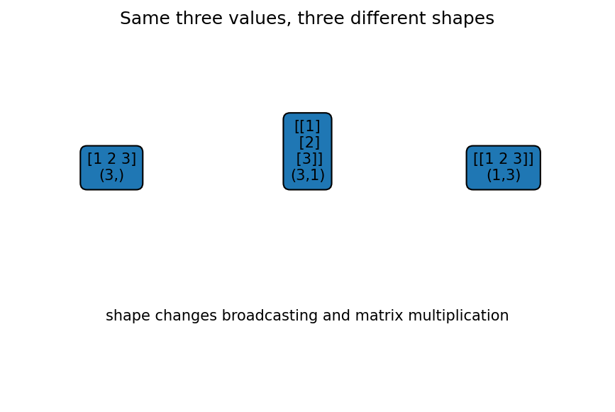

# NumPy配列・shape・indexing

Course 00｜学習準備

---

## 何を身につけるか

配列の値だけでなくshape・axis・dtypeを追い、indexingや行列積の結果shapeを実行前に予測するにはどうするか。

---

## 図

同じ値1,2,3でも `(3,)`、`(3,1)`、`(1,3)` の3形状を並べる。1次元vector、3×1列行列、1×3行行列は見た目の値が同じでも `@` やbroadcastingの結果が違う。

---

## 定義と理由

`ndim` は配列のaxis数、`shape` は各axisの長さ、`size` は全要素数。shape `(2,3,4)` ならndim=3, size=24。

`A[:,1]` はaxisを1本落として `(m,)` になるが、`A[:,1:2]` は `(m,1)` を保つ。1D arrayの `.T` はshapeを変えない。

`A*B` はelementwise、`A@B` はmatrix multiplication。broadcastingは末尾axisから長さが一致するか1である場合に拡張する。

---

## 具体例

A.shape=(2,3), B.shape=(3,4)なら `A@B` は(2,4)。A[:,1]は(2,), A[:,1:2]は(2,1)。

---

## ここで誤ると

reshapeは要素数を保つだけでaxisの意味を理解しない。sample axisとfeature axisを誤って入れ替えてもエラーにならないことがある。

---

## 次へ

Course02の行列shape、Course08/09のbatch×feature×channelを読む基礎。

---

[教科書](../../textbook/prep-numpy-arrays-shapes)　|　[演習](../../exercises/prep-numpy-arrays-shapes)
