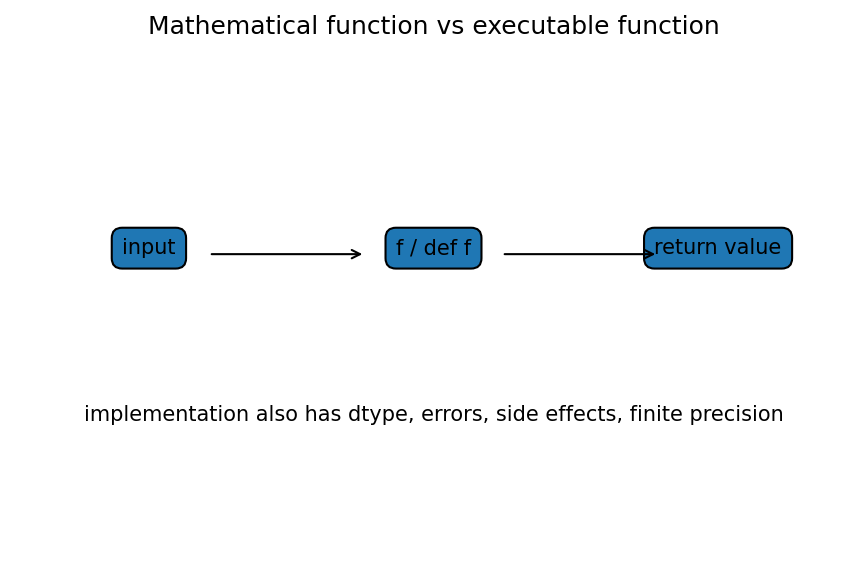

# Pythonの式・変数・関数

Course 00｜学習準備

---

## 何を身につけるか

数学上の式をPythonへ写すとき、値・型・副作用・例外を区別し、検算可能な小さな関数として実装するにはどうするか。

---

## 図

input xがPython関数 `def f(x): ...` に入りreturn valueへ出る。数学関数と違い、実装にはdtype、有限精度、例外、mutable stateなど追加要素があるため、同じ数式でも実装上の振る舞いが変わり得る。

---

## 定義と理由

式 `y = 2*x + 1` では右辺を先に評価し、その結果を名前yへbindする。Python変数は数学の未知数ではなくobjectへの名前。

関数は入力parameterとreturnを明示する。純粋関数に近づけると同じ入力に同じ出力が得られ、数学との対応とtestが容易になる。

整数 `/` はfloating division、`//` はfloor division。`**` が累乗で `^` はbitwise XOR。

---

## 具体例

`def square_plus_one(x): return x**2 + 1` にx=3なら10。`3^2` は1であり9ではないため、演算子の意味を確認する。

---

## ここで誤ると

global listを書き換える関数は、同じ入力でも呼び出し回数で結果やstateが変わる。数学関数と同一視しない。

---

## 次へ

NumPy、数値実験、ML training codeの再現性へ続く。

---

[教科書](../../textbook/prep-python-expressions-functions)　|　[演習](../../exercises/prep-python-expressions-functions)
