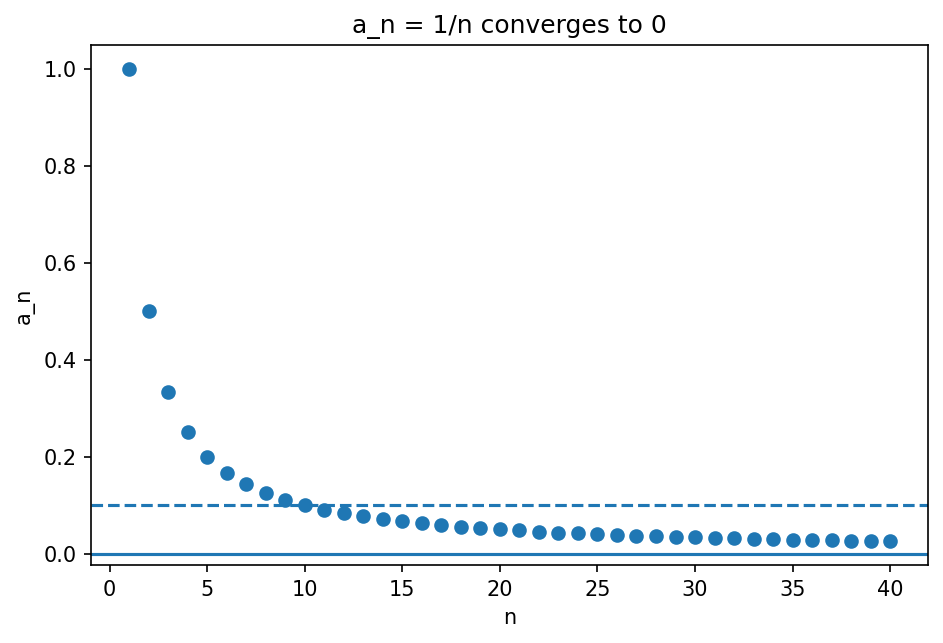

# 数列・収束の初歩

Course 00｜学習準備

---

## 今回の問い

「nを大きくすると近づく」を、数列の収束としてどう厳密に書くか。

---

## 直感

数列は自然数 n を入力して数 a_n を返す関数。極限は「十分後ろの項を全部、目標値の任意に小さい近傍へ入れられる」という主張。

---

## 図解

---

## 中心式

$$
a_n\to L\iff \forall\varepsilon>0\;\exists N\;\forall n\ge N:\ |a_n-L|<\varepsilon
$$

---

## 導出

1. 許容誤差 ε を任意に固定する。
2. その ε に応じた N を選ぶ。
3. N 以降の全ての n で誤差が ε 未満なら収束と定義する。

---

## 小さい例

a_n=1/n は0へ収束。ε>0に対し N>1/ε と取れば n≥N で1/n≤1/N<ε。

---

## 条件を外すと

- 有限個の項が外れても収束を妨げない。
- 「多くの項」ではなく N 以降の全項である。

---

## 理解確認

- 式の各記号を定義できるか。
- 導出を1段ずつ再現できるか。
- 反例を1つ作れるか。

---

## 教科書と演習

[教科書](../../textbook/prep-sequences-basics)

[10問の演習](../../exercises/prep-sequences-basics)
