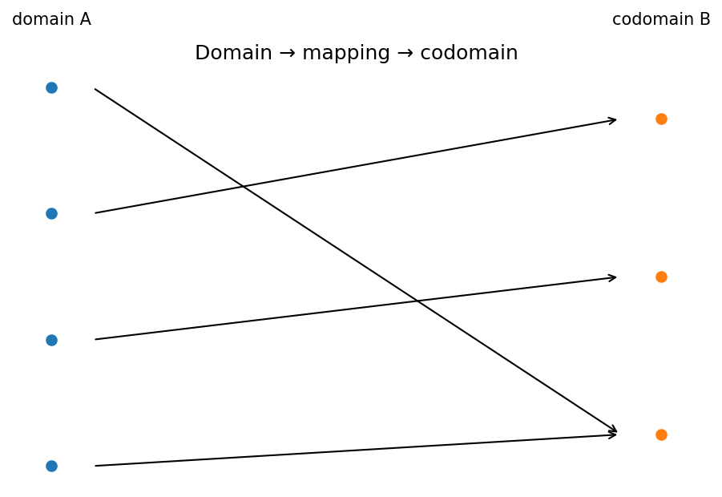

# 集合・関数・写像

Course 00｜学習準備

---

## 何を身につけるか

関数を「式」ではなく、定義域の各要素を終域のちょうど1要素へ対応させる写像としてどう読むか。

---

## 図

左の点集合が定義域 $A$、右が終域 $B$。各左点から矢印がちょうど1本出ていることが「関数」である条件。同じ右点へ複数矢印が入るのは許される。右側で実際に矢印が到達した点だけを集めた集合が値域 $f(A)$ で、終域B全体とは一致しない場合がある。

---

## 定義と理由

### 集合
$x\in A$ はxが集合Aの要素、$A\subseteq B$ はAの全要素がBにも属することを表す。和集合 $A\cup B$、共通部分 $A\cap B$、差集合 $A\setminus B$ を定義する。

### 関数
$f:A\to B$ は、各 $x\in A$ に対してただ1つの $f(x)\in B$ を対応させる規則。Aが定義域、Bが終域。値域は $f(A)=\{f(x):x\in A\}\subseteq B$。

### 単射・全射・全単射
単射は $f(x_1)=f(x_2)\Rightarrow x_1=x_2$。全射は $f(A)=B$。両方なら全単射で、逆関数 $f^{-1}:B\to A$ を定義できる。

---

## 具体例

**例**：$f:\mathbb R\to\mathbb R$, $f(x)=x^2$ は単射でも全射でもない。終域を $[0,\infty)$ に変えれば全射だが単射ではない。定義域を $[0,\infty)$ にも制限すると全単射になり $f^{-1}(y)=\sqrt y$。

---

## ここで誤ると

「式が同じなら同じ関数」ではない。$x^2:\mathbb R\to\mathbb R$ と $x^2:[0,\infty)\to[0,\infty)$ は定義域・終域が違う別の関数。

---

## 次へ

線形写像、確率変数、loss function、neural networkはすべて集合間の写像として読める。

---

[教科書](../../textbook/prep-sets-functions-mappings)　|　[演習](../../exercises/prep-sets-functions-mappings)
