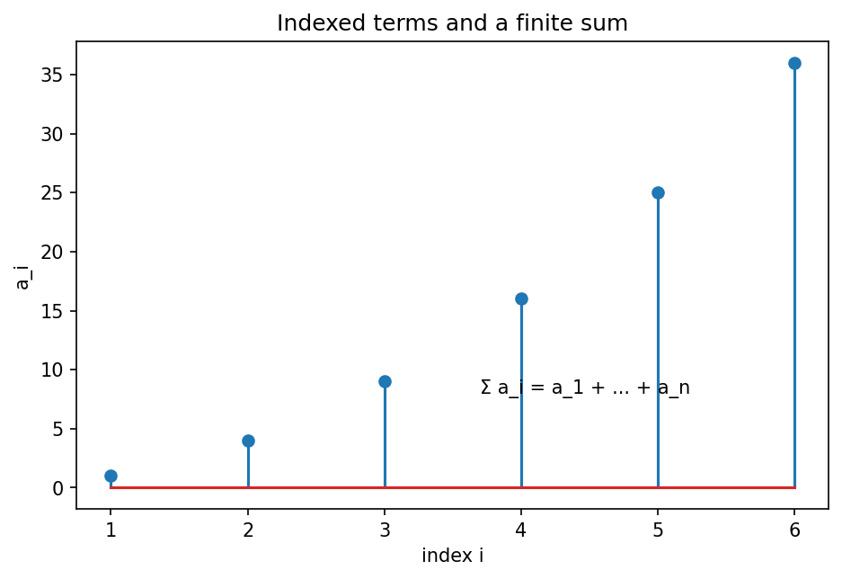

# 総和・積・添字

Course 00｜学習準備

---

## 何を身につけるか

$\sum$ や添字を、どのindexを走査し、どのindexが結果に残るかまで含めて正確に読むにはどうするか。

---

## 図

横軸iに並ぶ棒が各項 $a_i$。$\sum_{i=1}^n a_i$ は棒の高さをi=1からnまで全部足す。iは総和の中だけで値を変えるdummy indexなので、結果には残らない。一方 $b_j=\sum_i A_{ji}x_i$ ではiは消えるがjは左辺に残るfree index。

---

## 定義と理由

### 有限和
$\sum_{i=1}^n a_i=a_1+a_2+\cdots+a_n$。index iは1,2,...,nを順に取る。$\sum_i$ と範囲を省略する場合は、直前に範囲を定義しなければならない。

### 二重和
$\sum_{i=1}^m\sum_{j=1}^n a_{ij}$ はm×n個の項を足す。有限和なら順序を交換しても同じだが、無限和では絶対収束など追加条件が必要。

### 行列積との関係
$(\mathbf A\mathbf x)_j=\sum_{i=1}^n A_{ji}x_i$。行jを固定し、列index iについて掛けて足すことで出力成分jを得る。

---

## 具体例

$\sum_{i=1}^4(2i-1)=1+3+5+7=16$。また $\sum_{i=1}^3 i^2=1+4+9=14$。index名をkへ変えても値は同じ。

---

## ここで誤ると

$\sum_i a_i b_j$ でjを勝手に足してはいけない。iだけがdummy indexで、jは結果に残る。

---

## 次へ

内積、行列積、期待値、lossのsample平均、backpropのparameter sumで必須。

---

[教科書](../../textbook/prep-sums-products-indices)　|　[演習](../../exercises/prep-sums-products-indices)
