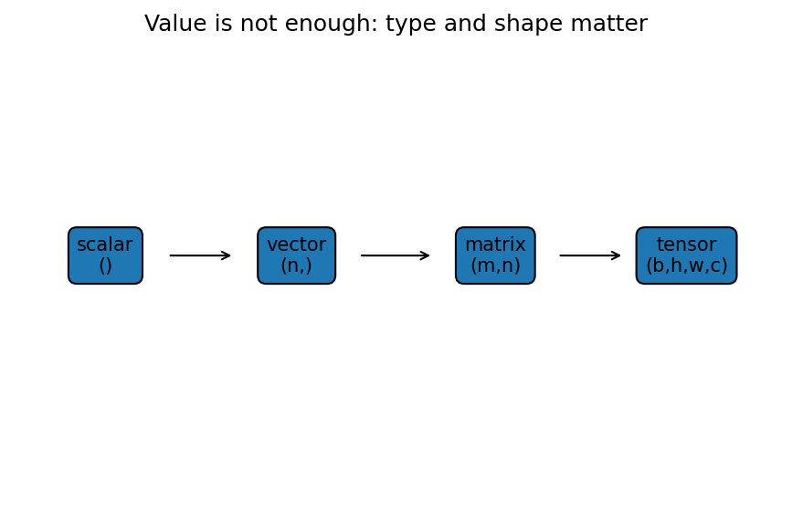

# 数式・記号・型・次元

Course 00｜学習準備

---

## 今回の問い

式を計算する前に、scalar・vector・matrix・tensorの型とshapeをどう確認するか。

---

## 直感

値が同じでも型・shapeが違えば許される演算が違う。数式の「何を表すか」と実装の「どう格納するか」を分離して読む。

---

## 図解

---

## 中心式

$$
A\mathbf{x}\in\mathbb R^m\quad(A\in\mathbb R^{m\times n},\;\mathbf{x}\in\mathbb R^n)
$$

---

## 導出

1. 行列Aの各rowとxの内積が出力1成分になる。
2. Aにはm rowsがあるので出力はm成分。
3. inner dimension n が一致しなければ行列積は定義できない。

---

## 小さい例

Aが2×3、xが3成分ならAxは2成分。xが2成分ならAxは未定義。

---

## 条件を外すと

- 数学のvector次元nとNumPy ndimを混同しない。

---

## 理解確認

- 式の各記号を定義できるか。
- 導出を1段ずつ再現できるか。
- 反例を1つ作れるか。

---

## 教科書と演習

[教科書](../../textbook/prep-symbols-types-shapes)

[10問の演習](../../exercises/prep-symbols-types-shapes)
