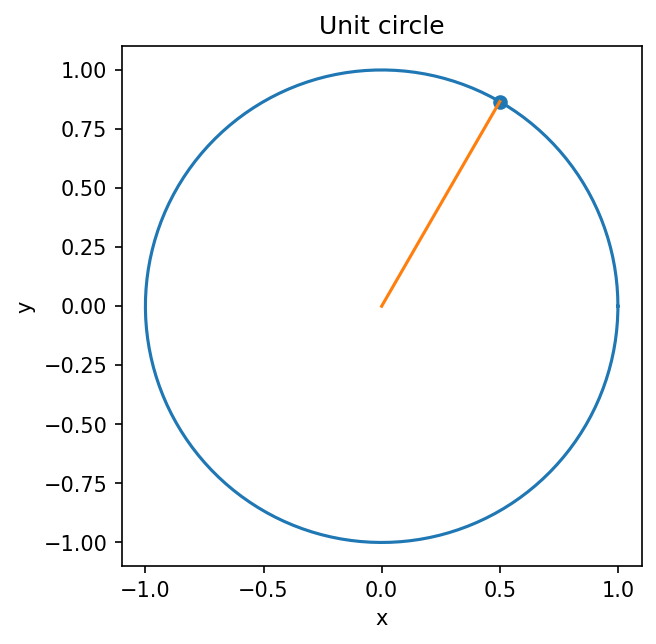

# 三角関数・ラジアン・単位円

Course 00｜学習準備

---

## 何を解決するか

角度をラジアンで測ると、なぜ微積分の三角関数公式が自然な形になるのか。

単位円上の点を角度で動かすと、横座標が cos、縦座標が sin になる。ラジアンは円弧長そのものなので、微小角と微小変位を同じ尺度で比較できる。

---

## 図の意味

図の円は半径1の単位円で、横軸が実数座標 $x$、縦軸が $y$ である。原点から角度 $\theta$ だけ回した半径の先端が $(\cos\theta,\sin\theta)$。図中の水平成分が $\cos\theta$、垂直成分が $\sin\theta$ なので、先端が円周上にある事実 $x^2+y^2=1$ がそのまま $\cos^2\theta+\sin^2\theta=1$ を与える。

---

## 記号

| 記号 | 意味 |
|---|---|
| $θ$ | ラジアンで測った角度 |
| $sin θ$ | 単位円上の y 座標 |
| $cos θ$ | 単位円上の x 座標 |

- $\theta$：角度。特に断らない限りradで測る。
- $r$：円の半径、$s$：その角度が切り取る円弧長。$\theta=s/r$。

---

## 中心式

$$
\sin^2\theta+\cos^2\theta=1
$$

---

## 導出

1. 単位円上の点を $(x,y)=(\cos\theta,\sin\theta)$ と置く。
2. 単位円の方程式 $x^2+y^2=1$ へ代入する。
3. $\cos^2\theta+\sin^2\theta=1$ を得る。

---

## 省略しない一段

ラジアンの定義を先に固定する。半径 $r$ の円で中心角 $\theta$ が切り取る円弧長を $s$ とすると、$\theta=s/r$。単位円なら $r=1$ なので $\theta=s$ であり、角度の数値そのものが円周上を進んだ長さになる。だから微小角 $d\theta$ と円弧上の微小変位を直接比較できる。

度数法で $\sin x$ を微分すると、角度単位の変換係数 $\pi/180$ が必ず付く。ラジアンではその係数が1になるので $d(\sin x)/dx=\cos x$ という最も自然な形になる。これは慣習ではなく、角度を弧長比として測った結果である。

---

## 手計算

**問題**：半径3の円で円弧長が $2\pi$ のとき中心角をradとdegreeで求め、その角の $\sin,\cos$ を単位円から決めよ。

**解答**：中心角は $\theta=s/r=2\pi/3$ rad =120°。単位円の第2象限なので $\cos\theta=-1/2$, $\sin\theta=\sqrt3/2$。

---

## 条件を変える

半径2の円で円弧長が $\pi$ なら中心角は $\theta=s/r=\pi/2$ rad。したがって90°に対応する。逆に60°は $60\pi/180=\pi/3$ rad。

---

## どこで壊れるか

角度を「数値だけ」で扱い、度とradを混ぜると微分公式や数値計算がずれる。たとえばPython/NumPyの `sin` は通常radを入力とするので `sin(30)` は $\sin30^\circ$ ではない。

---

## 次へ

この単位円表示はCourse 00の複素数で $e^{i\theta}$ の回転を理解する土台になり、Course 01の三角関数の微分・極座標、Course 07のFourierへそのまま続く。

---

[教科書](../../textbook/prep-trigonometry-radians-unit-circle)　|　[10問の演習](../../exercises/prep-trigonometry-radians-unit-circle)
