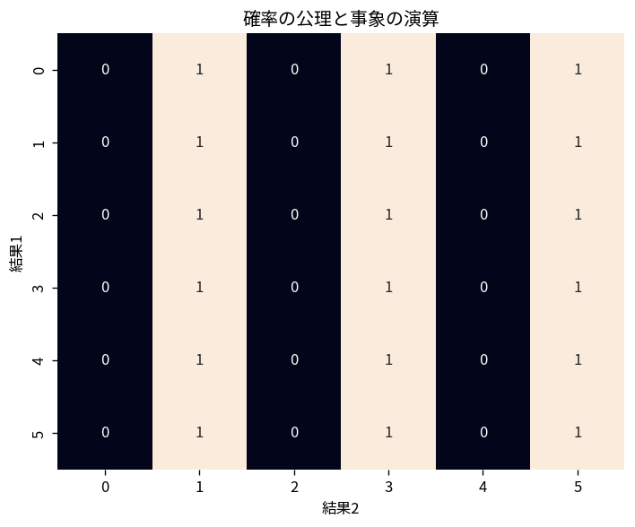

# 確率の公理と事象の演算

Course 03｜確率統計｜Topic 02/20

---
layout: center
---

## 今回の問い

## 到達目標

- 定義と代表式を、自分の言葉と記号で説明できる。
- 成立条件を確認し、手計算と結果を検算できる。

## 理解確認

- 定義・条件・計算結果を自分の言葉で説明できるか確認する。

確率の公理と事象の演算の代表式は、どの定義・仮定から、なぜその形になるのか。

---

## なぜ今これを学ぶのか

前Topic `prob-counting-sample-spaces` で得た概念を使い、ここでは 確率の公理と事象の演算 へ進む。

---

## 直感

確率は事象へ0〜1の重みを与え、和・積・補集合の規則で複雑な事象を組み立てる。

---

## 図解

2個のサイコロの標本空間を格子で描き、事象をセル集合として見る。 格子の1セルが1つの基本結果、色付き領域が事象である。和事象は領域の和集合、積事象は共通部分、補事象は標本空間からその領域を除いた部分に対応する。

---

## 記号と代表式

- $\Omega$：標本空間
- $A,B$：事象
- $A\cup B$：AまたはBが起こる事象
- $A\cap B$：AとBが同時に起こる事象
- $A^c$：Aが起こらない事象

$$
\mathbb{P}(A\cup B)=\mathbb{P}(A)+\mathbb{P}(B)-\mathbb{P}(A\cap B)
$$

---

## 導出 1

$A\cup B=A\cup(B\setminus A)$ で、この2部分は排反。したがって $\mathbb P(A\cup B)=\mathbb P(A)+\mathbb P(B\setminus A)$。

---

## 導出 2

$B=(B\setminus A)\cup(A\cap B)$ も排反なので $\mathbb P(B)=\mathbb P(B\setminus A)+\mathbb P(A\cap B)$。よって $\mathbb P(B\setminus A)=\mathbb P(B)-\mathbb P(A\cap B)$。

---

## 例題

$\mathbb P(A)=0.6$, $\mathbb P(B)=0.5$, $\mathbb P(A\cap B)=0.2$ なら、和事象は $0.6+0.5-0.2=0.9$。単純に1.1とするのは二重計上。

---

## 条件を変えるとどうなるか

「排反なら独立」とは限らない。$\mathbb P(A),\mathbb P(B)>0$ の排反事象では $\mathbb P(A\cap B)=0$ だが $\mathbb P(A)\mathbb P(B)>0$ なので独立条件を満たさない。

---

## よくある誤解

確率の公理と事象の演算では、式へ数値を代入するだけでは不十分である。「排反なら独立」とは限らない。$\mathbb P(A),\mathbb P(B)>0$ の排反事象では $\mathbb P(A\cap B)=0$ だが $\mathbb P(A)\mathbb P(B)>0$ なので独立条件を満たさない。 という失敗例が示すように、式を使える条件と結論の範囲を区別する必要がある。

---

## 実装・計算上の注意

simulationで事象をboolean配列として表すと、unionはOR、intersectionはAND。有限標本で相対頻度を使い、公理から導いた恒等式が近似的に成立するか確認できる。

---

## 一段先へ

公理から補集合、単調性、Booleの不等式など多くの性質を導ける。次Topicでは交わりを「Bが起きた世界の中」で再正規化して条件付き確率を定義する。

---

## 自分で説明できるか

- 「和集合を重複しない部分へ分ける」を式を見ずに説明できるか
- 「代入して包含排除を得る」までの論理を一段ずつ再現できるか
- 確率の公理と事象の演算の条件を1つ外した反例を説明できるか

---
layout: center
---

## 教科書と演習

- [教科書](../../textbook/prob-axioms-event-operations)
- [10問の演習](../../exercises/prob-axioms-event-operations)
