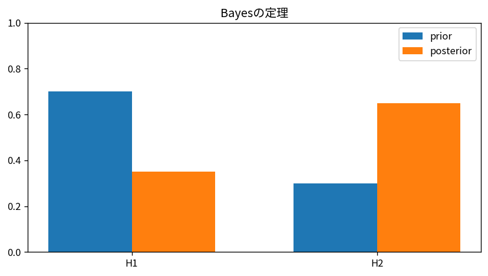

# Bayesの定理

Course 03｜確率統計｜Topic 04/20

---
layout: center
---

## 今回の問い

## 到達目標

- 定義と代表式を、自分の言葉と記号で説明できる。
- 成立条件を確認し、手計算と結果を検算できる。

## 理解確認

- 定義・条件・計算結果を自分の言葉で説明できるか確認する。

Bayesの定理の代表式は、どの定義・仮定から、なぜその形になるのか。

---

## なぜ今これを学ぶのか

前Topic `prob-conditional-probability-independence` で得た概念を使い、ここでは Bayesの定理 へ進む。

---

## 直感

Bayes更新は、事前の信念に観測の尤もらしさを掛け、全体で正規化して事後分布を得る。

---

## 図解

2つの仮説の事前確率が1回の観測でどう更新されるかを棒グラフで追う。 左の高さが観測前の仮説の重み、観測による尤度の倍率を掛けた中間量を正規化したものが右の事後確率である。観測と整合する仮説ほど棒が相対的に高くなる。

---

## 記号と代表式

- $A$：更新したい仮説
- $B$：観測した証拠
- $\mathbb P(A)$：観測前の事前確率
- $\mathbb P(B\mid A)$：仮説Aのもとで証拠Bが出る尤もらしさ
- $\mathbb P(A\mid B)$：観測後の事後確率

$$
\mathbb{P}(A\mid B)=\frac{\mathbb{P}(B\mid A)\mathbb{P}(A)}{\mathbb{P}(B)}
$$

---

## 導出 1

$\mathbb P(A\cap B)=\mathbb P(B\mid A)\mathbb P(A)$。これは条件付き確率の定義を掛け戻した積の法則。

---

## 導出 2

同じ交わりに対し $\mathbb P(A\cap B)=\mathbb P(A\mid B)\mathbb P(B)$。

---

## 例題

疾患有病率1%、感度90%、偽陽性率5%。陽性の総確率は $0.9\times0.01+0.05\times0.99=0.0585$。陽性後の疾患確率は $0.009/0.0585\approx0.154$。感度90%をそのまま事後確率にしてはいけない。

---

## 条件を変えるとどうなるか

「陽性なら90%の確率で病気」は感度 $P(+\mid D)$ と事後 $P(D\mid +)$ の取り違え。条件の向きを反転するには事前確率と偽陽性率を含む分母が必要。

---

## よくある誤解

Bayesの定理では、式へ数値を代入するだけでは不十分である。「陽性なら90%の確率で病気」は感度 $P(+\mid D)$ と事後 $P(D\mid +)$ の取り違え。条件の向きを反転するには事前確率と偽陽性率を含む分母が必要。 という失敗例が示すように、式を使える条件と結論の範囲を区別する必要がある。

---

## 実装・計算上の注意

log probabilityを使うと小さい尤度の積でunderflowしにくい。多数仮説ではlog尤度+log事前を計算してlog-sum-expで正規化する。

---

## 一段先へ

Aを連続パラメータ $	heta$ に置き換えるとBayesian推論へ進む。Course03後半では事後分布全体とMAP推定を扱う。

---

## 自分で説明できるか

- 「同時確率をAから分解する」を式を見ずに説明できるか
- 「同じ量を等置して解く」までの論理を一段ずつ再現できるか
- Bayesの定理の条件を1つ外した反例を説明できるか

---
layout: center
---

## 教科書と演習

- [教科書](../../textbook/prob-bayes-theorem)
- [10問の演習](../../exercises/prob-bayes-theorem)
