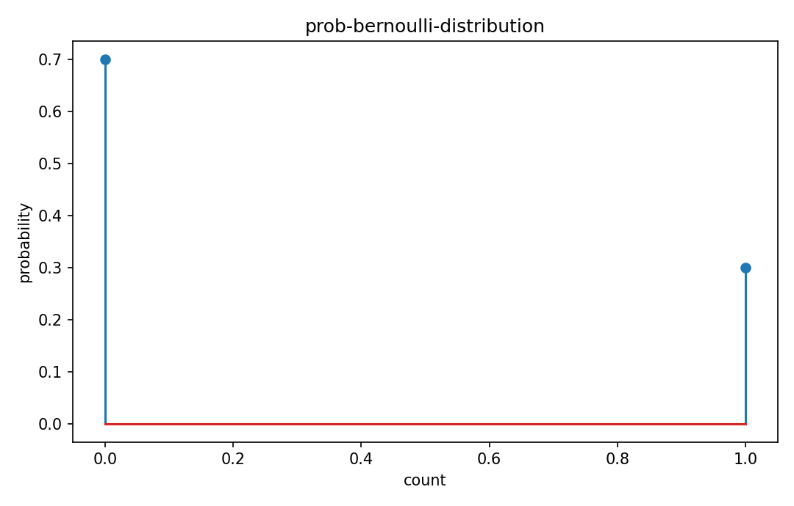

# Bernoulli分布

確率分布

---

## 問い

成功/失敗の1回試行を、最小の離散確率モデルとしてどう表すか。

---

## 記号とshape

- `$X`: 0/1 random variable (scalar)
- `$p`: success probability (0\le p\le1)

---

## 中心式

$$
P(X=x)=p^x(1-p)^{1-x},\quad x\in\{0,1\},\quad E[X]=p,\ \operatorname{Var}(X)=p(1-p)
$$

---

## 導出

- $P(X=1)=p$、$P(X=0)=1-p$ を1つの式へまとめる。
- $E[X]=0(1-p)+1p=p$。
- $X^2=X$ なので $\operatorname{Var}(X)=E[X]-E[X]^2=p(1-p)$。

---

## 図

---

## 小さな例

$p=0.3$ なら $P(X=1)=0.3$、平均0.3、分散0.21。1000回sampleすれば標本平均はおよそ0.3へ近づく。

---

## 何がわかるか

故障有無、クリック、検出/非検出、classification labelの基本model。

---

## 失敗条件

試行間依存や個体ごとのp変動が強い場合、単一Bernoulli parameterではheterogeneityを表せない。

---

## 実装検算

`rng.binomial(1,p,size=N)` の平均・分散を理論値と比較する。

---

## 式の読み方を固定する

Bernoulli分布はsupport・normalization・momentの3点を同時に確認すると理解しやすい。$X$ は 0/1 random variable（scalar）、$p$ は success probability（0\le p\le1）。中心式 `P(X=x)=p^x(1-p)^{1-x},\quad x\in\{0,1\},\quad E[X]=p,\ \operatorname{Var}(X)=p(1-p)` が非負で全support上の総和/積分が1になること、期待値やvarianceがsample simulationと一致することを別々に確認する。分布名だけを覚えず、どの生成機構がこの形を生むかまで結び付ける。

---

## 極限・反例で検算

- 手計算例: $p=0.3$ なら $P(X=1)=0.3$、平均0.3、分散0.21。1000回sampleすれば標本平均はおよそ0.3へ近づく。
- 失敗条件: 試行間依存や個体ごとのp変動が強い場合、単一Bernoulli parameterではheterogeneityを表せない。
- 実装検算: `rng.binomial(1,p,size=N)` の平均・分散を理論値と比較する。

---

## 工学での位置づけ

故障有無、クリック、検出/非検出、classification labelの基本model。

中心式 `P(X=x)=p^x(1-p)^{1-x},\quad x\in\{0,1\},\quad E[X]=p,\ \operatorname{Var}(X)=p(1-p)` のどの量が観測・未知parameter・weight・frequency成分に対応するかを区別する。

---

## 試験で書けるべきこと

- `Bernoulli分布` の記号とshapeを定義する
- `$P(X=1)=p$、$P(X=0)=1-p$ を1つの式へまとめる。` から中心式を導く
- `$p=0.3$ なら $P(X=1)=0.3$、平均0.3、分散0.21。1000回sampleすれば標本平均はおよそ0.3へ近づく。` を最後まで追う
- `試行間依存や個体ごとのp変動が強い場合、単一Bernoulli parameterではheterogeneityを表せない。` がなぜ問題か説明する

---

## 接続

Prerequisites: prob-random-variables-cdf-pmf-pdf

[教科書](../../textbook/prob-bernoulli-distribution)
[10問の演習](../../exercises/prob-bernoulli-distribution)
