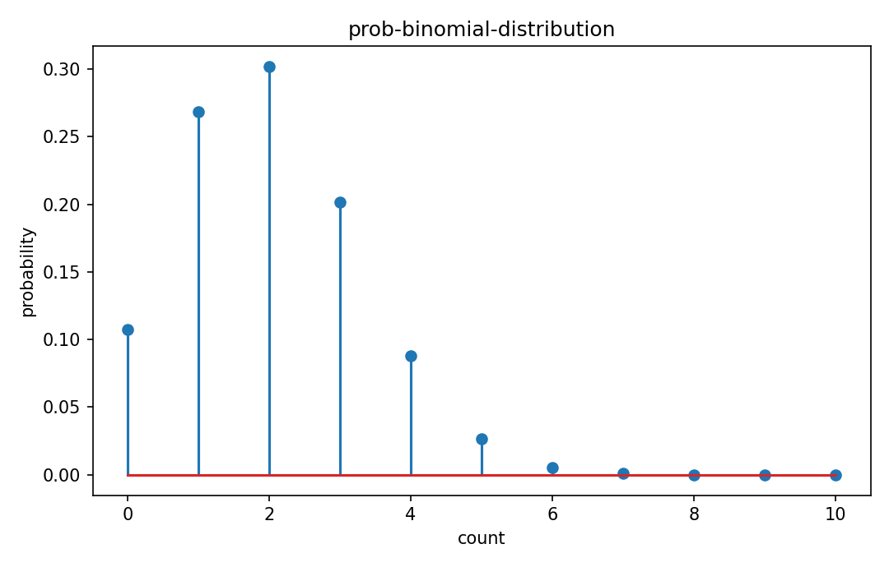

# Binomial分布

確率分布

---

## 問い

独立なBernoulli試行n回の成功回数をどうモデル化するか。

---

## 記号とshape

- `$n`: number of independent trials (positive integer)
- `$p`: common success probability ([0,1])
- `$X`: success count (0,...,n)

---

## 中心式

$$
P(X=k)=\binom nk p^k(1-p)^{n-k},\quad E[X]=np,\quad \operatorname{Var}(X)=np(1-p)
$$

---

## 導出

- $X=\sum_{i=1}^nB_i$ と独立Bernoulliの和として定義する。
- 成功位置の選び方が $\binom nk$ 通りあり、各列の確率は $p^k(1-p)^{n-k}$。
- 期待値・分散は独立和の加法性から $np$ と $np(1-p)$。

---

## 図

---

## 小さな例

$n=10,p=0.2$ のとき $P(X=2)=\binom{10}{2}0.2^2 0.8^8\approx0.302$、平均2。

---

## 何がわかるか

品質検査でn個中の不良数、通信packet成功数、陽性細胞数の単純model。

---

## 失敗条件

試行のpが異なる、または独立でない場合は通常のBinomialではない。Poisson-binomialやbeta-binomial等を検討する。

---

## 実装検算

`scipy.stats.binom.pmf` と組合せ式を比較し、pmf総和が1になるか確認する。

---

## 式の読み方を固定する

Binomial分布はsupport・normalization・momentの3点を同時に確認すると理解しやすい。$n$ は number of independent trials（positive integer）、$p$ は common success probability（[0,1]）、$X$ は success count（0,...,n）。中心式 `P(X=k)=\binom nk p^k(1-p)^{n-k},\quad E[X]=np,\quad \operatorname{Var}(X)=np(1-p)` が非負で全support上の総和/積分が1になること、期待値やvarianceがsample simulationと一致することを別々に確認する。分布名だけを覚えず、どの生成機構がこの形を生むかまで結び付ける。

---

## 極限・反例で検算

- 手計算例: $n=10,p=0.2$ のとき $P(X=2)=\binom{10}{2}0.2^2 0.8^8\approx0.302$、平均2。
- 失敗条件: 試行のpが異なる、または独立でない場合は通常のBinomialではない。Poisson-binomialやbeta-binomial等を検討する。
- 実装検算: `scipy.stats.binom.pmf` と組合せ式を比較し、pmf総和が1になるか確認する。

---

## 工学での位置づけ

品質検査でn個中の不良数、通信packet成功数、陽性細胞数の単純model。

中心式 `P(X=k)=\binom nk p^k(1-p)^{n-k},\quad E[X]=np,\quad \operatorname{Var}(X)=np(1-p)` のどの量が観測・未知parameter・weight・frequency成分に対応するかを区別する。

---

## 試験で書けるべきこと

- `Binomial分布` の記号とshapeを定義する
- `$X=\sum_{i=1}^nB_i$ と独立Bernoulliの和として定義する。` から中心式を導く
- `$n=10,p=0.2$ のとき $P(X=2)=\binom{10}{2}0.2^2 0.8^8\approx0.302$、平均2。` を最後まで追う
- `試行のpが異なる、または独立でない場合は通常のBinomialではない。Poisson-binomialやbeta-binomial等を検討する。` がなぜ問題か説明する

---

## 接続

Prerequisites: prob-bernoulli-distribution, prob-expectation-variance-moments

[教科書](../../textbook/prob-binomial-distribution)
[10問の演習](../../exercises/prob-binomial-distribution)
