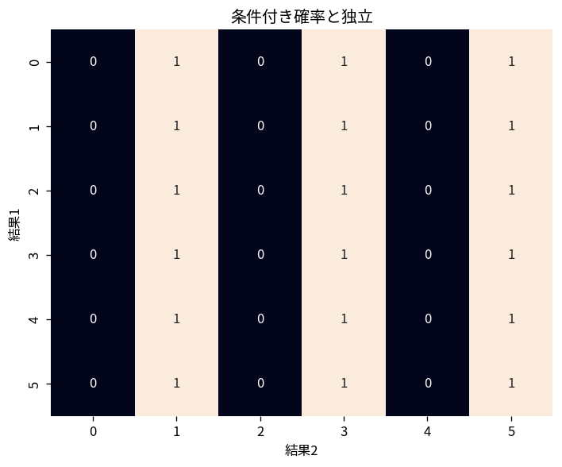

# 条件付き確率と独立

Course 03｜確率統計｜Topic 03/20

---
layout: center
---

## 今回の問い

## 到達目標

- 定義と代表式を、自分の言葉と記号で説明できる。
- 成立条件を確認し、手計算と結果を検算できる。

## 理解確認

- 定義・条件・計算結果を自分の言葉で説明できるか確認する。

条件付き確率と独立の代表式は、どの定義・仮定から、なぜその形になるのか。

---

## なぜ今これを学ぶのか

前Topic `prob-axioms-event-operations` で得た概念を使い、ここでは 条件付き確率と独立 へ進む。

---

## 直感

条件付き確率は「Bが起きた世界」に標本空間を絞って再正規化する操作。

---

## 図解

標本空間のB領域だけを残し、その中でAが占める割合を見る。 条件Bを課す操作は、標本空間全体をBの領域へ切り縮め、その中でA∩Bが占める割合を測り直す操作である。したがって分母がP(B)になる。

---

## 記号と代表式

- $A,B$：事象
- $\mathbb P(B)>0$：条件Bが実際に確率を持つための条件
- $\mathbb P(A\mid B)$：Bが起きたと分かった後のAの確率

$$
\mathbb{P}(A\mid B)=\frac{\mathbb{P}(A\cap B)}{\mathbb{P}(B)}
$$

---

## 導出 1

Bが起きたと分かった後は、Bの外側は候補から消える。Aが起きるには $A\cap B$ に入る必要がある。

---

## 導出 2

元の確率尺度でBの大きさは $\mathbb P(B)$、その中のA部分は $\mathbb P(A\cap B)$。比を取ると $\mathbb P(A\mid B)=\mathbb P(A\cap B)/\mathbb P(B)$。

---

## 例題

52枚のカードから1枚。B=「赤」、A=「エース」。赤26枚中赤エース2枚なので $\mathbb P(A\mid B)=2/26=1/13$。元のエース確率4/52も1/13なのでAとBは独立。

---

## 条件を変えるとどうなるか

$\mathbb P(B)=0$ のとき単純な比による条件付き確率は定義できない。連続分布で「X=x」という確率0の条件を扱うには条件付き密度など別の定義が必要。

---

## よくある誤解

条件付き確率と独立では、式へ数値を代入するだけでは不十分である。$\mathbb P(B)=0$ のとき単純な比による条件付き確率は定義できない。連続分布で「X=x」という確率0の条件を扱うには条件付き密度など別の定義が必要。 という失敗例が示すように、式を使える条件と結論の範囲を区別する必要がある。

---

## 実装・計算上の注意

データで条件付き頻度を求めるときは、Bに該当する標本数が小さいと推定誤差が大きい。論理上の条件付き確率と有限標本の推定値を区別する。

---

## 一段先へ

積の法則 $\mathbb P(A\cap B)=\mathbb P(A\mid B)\mathbb P(B)$ を左右入れ替えて等置するとBayesの定理が自然に出る。

---

## 自分で説明できるか

- 「Bの中だけを新しい世界とみなす」を式を見ずに説明できるか
- 「独立条件を導く」までの論理を一段ずつ再現できるか
- 条件付き確率と独立の条件を1つ外した反例を説明できるか

---
layout: center
---

## 教科書と演習

- [教科書](../../textbook/prob-conditional-probability-independence)
- [10問の演習](../../exercises/prob-conditional-probability-independence)
