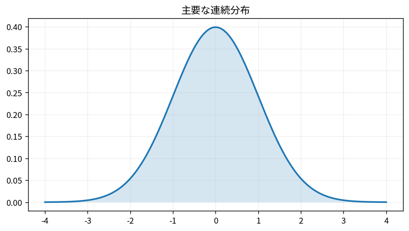

# 主要な連続分布

Course 03｜確率統計｜Topic 10/20

---
layout: center
---

## 今回の問い

## 到達目標

- 定義と代表式を、自分の言葉と記号で説明できる。
- 成立条件を確認し、手計算と結果を検算できる。

## 理解確認

- 定義・条件・計算結果を自分の言葉で説明できるか確認する。

主要な連続分布の代表式は、どの定義・仮定から、なぜその形になるのか。

---

## なぜ今これを学ぶのか

前Topic `prob-discrete-distributions` で得た概念を使い、ここでは 主要な連続分布 へ進む。

---

## 直感

分布は確率変数がどの値をどれくらい取りやすいかをまとめたもの。PMF/PDFとCDFは同じ分布の別表現。

---

## 図解

離散分布の棒と連続分布の曲線、CDFの累積を並べる。 離散なら棒1本が1点の確率、連続なら曲線下の区間面積が確率である。CDFは左端からその位置までの確率を累積するので必ず非減少になる。

---

## 記号と代表式

- $\mu$：正規分布の平均
- $\sigma^2>0$：分散
- $f_X(x)$：PDF
- $Z=(X-\mu)/\sigma$：標準化変数

$$
X\sim\mathcal{N}(\mu,\sigma^2)
$$

---

## 導出 1

$x-\mu$ で中心を0へ移し、$\sigma$ で割って単位を除くと $z=(x-\mu)/\sigma$。

---

## 導出 2

標準正規密度 $\phi(z)$ に $z=(x-\mu)/\sigma$ を代入し、$dx=\sigma dz$ を保つため密度には $1/\sigma$ が掛かる。

---

## 例題

$X\sim N(10,4)$ なら標準偏差2。$P(X\le12)=P(Z\le1)=\Phi(1)\approx0.8413$。

---

## 条件を変えるとどうなるか

正規分布の密度の最大値が1を超える場合があっても問題ない。確率は面積であり、狭い分布では高さが1を超え得る。

---

## よくある誤解

主要な連続分布では、式へ数値を代入するだけでは不十分である。正規分布の密度の最大値が1を超える場合があっても問題ない。確率は面積であり、狭い分布では高さが1を超え得る。 という失敗例が示すように、式を使える条件と結論の範囲を区別する必要がある。

---

## 実装・計算上の注意

CDFの極端なtailでは 1-cdf より survival functionを使う方が数値精度が良いことがある。random generatorのparameterがvarianceかstandard deviationかも確認する。

---

## 一段先へ

正規分布は独立な小効果の和の極限としてCLTに現れる。多変数版では平均ベクトルと共分散行列で楕円形の等密度面を表す。

---

## 自分で説明できるか

- 「中心と幅を分ける」を式を見ずに説明できるか
- 「区間確率をCDFで求める」までの論理を一段ずつ再現できるか
- 主要な連続分布の条件を1つ外した反例を説明できるか

---
layout: center
---

## 教科書と演習

- [教科書](../../textbook/prob-continuous-distributions)
- [10問の演習](../../exercises/prob-continuous-distributions)
