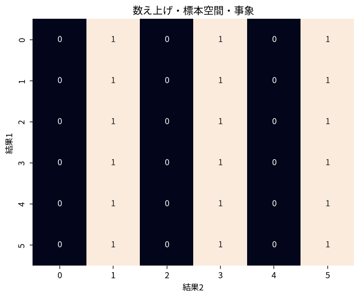

# 数え上げ・標本空間・事象

Course 03｜確率統計｜Topic 01/20

---
layout: center
---

## 今回の問い

## 到達目標

- 定義と代表式を、自分の言葉と記号で説明できる。
- 成立条件を確認し、手計算と結果を検算できる。

## 理解確認

- 定義・条件・計算結果を自分の言葉で説明できるか確認する。

数え上げ・標本空間・事象の代表式は、どの定義・仮定から、なぜその形になるのか。

---

## なぜ今これを学ぶのか

Course 03 の入口として、数え上げ・標本空間・事象 を定義から組み立てる。

---

## 直感

数え上げでは、順序を区別するか、重複を許すか、条件を満たすかを先に決める。

---

## 図解

小さな4要素集合から2要素を選ぶ全ケースを並べ、順列と組合せを比較する。 図中の各点・枝は1つの可能な選択を表す。順序を区別する経路と、同じ集合へ合流する経路を比較すると、順列で掛けた重複を組合せでは階乗で割る理由が見える。

---

## 記号と代表式

- $\Omega$：起こり得る結果をすべて集めた標本空間
- $A\subseteq\Omega$：事象
- $n$：区別できる対象の総数
- $k$：そこから選ぶ個数
- $\binom nk$：順序を区別しない選び方の数

$$
\binom{n}{k}=\frac{n!}{k!(n-k)!}
$$

---

## 導出 1

$n$ 個から異なる $k$ 個を順に選ぶと $n(n-1)\cdots(n-k+1)=n!/(n-k)!$ 通り。

---

## 導出 2

選ばれた同じ $k$ 個は並べ方が $k!$ 通りある。順序を区別しないなら各集合を $k!$ 回ずつ重複して数えているので、$\binom nk=\frac{n!}{k!(n-k)!}$。

---

## 例題

5人から委員2人を選ぶ。順序付きなら $5\times4=20$ 通りだが、A→B と B→A は同じ委員会なので2で割り、$\binom52=10$ 通り。

---

## 条件を変えるとどうなるか

サイコロ2個の和だけを標本空間 $\{2,3,\ldots,12\}$ として11通り等確率と扱うのは誤り。和7は6通り、和2は1通りの基本結果から生じ、和は等確率ではない。

---

## よくある誤解

数え上げ・標本空間・事象では、式へ数値を代入するだけでは不十分である。サイコロ2個の和だけを標本空間 $\{2,3,\ldots,12\}$ として11通り等確率と扱うのは誤り。和7は6通り、和2は1通りの基本結果から生じ、和は等確率ではない。 という失敗例が示すように、式を使える条件と結論の範囲を区別する必要がある。

---

## 実装・計算上の注意

列挙コードを書くときも、基本結果をtupleで持つか、集約後の値だけ持つかで確率の重みが変わる。小規模問題では全列挙して理論値と照合するとよい。

---

## 一段先へ

このTopicでは有限・等確率の場合を扱った。次に確率の公理を導入すると、等確率でない場合や無限標本空間でも同じ「事象へ数を割り当てる」枠組みへ一般化できる。

---

## 自分で説明できるか

- 「まず順序付きに数える」を式を見ずに説明できるか
- 「確率へ戻す」までの論理を一段ずつ再現できるか
- 数え上げ・標本空間・事象の条件を1つ外した反例を説明できるか

---
layout: center
---

## 教科書と演習

- [教科書](../../textbook/prob-counting-sample-spaces)
- [10問の演習](../../exercises/prob-counting-sample-spaces)
