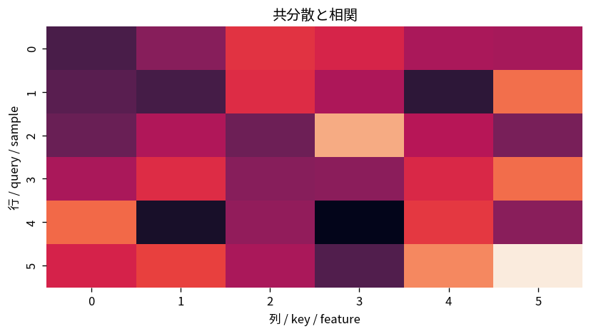

# 共分散と相関

Course 03｜確率統計｜Topic 08/20

---
layout: center
---

## 今回の問い

## 到達目標

- 定義と代表式を、自分の言葉と記号で説明できる。
- 成立条件を確認し、手計算と結果を検算できる。

## 理解確認

- 定義・条件・計算結果を自分の言葉で説明できるか確認する。

共分散と相関の代表式は、どの定義・仮定から、なぜその形になるのか。

---

## なぜ今これを学ぶのか

前Topic `prob-joint-marginal-conditional-distributions` で得た概念を使い、ここでは 共分散と相関 へ進む。

---

## 直感

同時分布は複数変数の組を一度に扱い、周辺化は不要な軸を足し合わせる操作。

---

## 図解

2次元ヒートマップから行・列方向に足して周辺分布を作る。 2軸は2つの変数、各セルや密度の高さは同時にその値を取る重みを表す。一方の軸方向へ足し上げる・積分すると他方だけの周辺分布が残る。

---

## 記号と代表式

- $\mu_X,\mu_Y$：各変数の平均
- $\operatorname{Cov}(X,Y)=E[(X-\mu_X)(Y-\mu_Y)]$
- $\rho_{X,Y}$：標準偏差で規格化した相関係数

$$
\rho_{X,Y}=\frac{\operatorname{Cov}(X,Y)}{\sqrt{\operatorname{Var}(X)\operatorname{Var}(Y)}}
$$

---

## 導出 1

Xが平均より上のときYも上なら積は正、逆方向なら負。平均を取ると一緒に動く方向を符号付きで要約できる。

---

## 導出 2

$E[(X-\mu_X)(Y-\mu_Y)]$ を展開すると $E[XY]-\mu_X\mu_Y$。交差項は期待値の線形性で整理される。

---

## 例題

$Y=2X+1$ なら中心化後 $Y-EY=2(X-EX)$。したがってCov(X,Y)=2Var(X)、$\sigma_Y=2\sigma_X$（正の2）なので相関は1。

---

## 条件を変えるとどうなるか

「相関0なら独立」は一般には偽。多変量正規など追加条件の下では成り立つが、$Y=X^2$ のような決定的非線形関係でも相関0になり得る。

---

## よくある誤解

共分散と相関では、式へ数値を代入するだけでは不十分である。「相関0なら独立」は一般には偽。多変量正規など追加条件の下では成り立つが、$Y=X^2$ のような決定的非線形関係でも相関0になり得る。 という失敗例が示すように、式を使える条件と結論の範囲を区別する必要がある。

---

## 実装・計算上の注意

相関行列は欠損値処理、外れ値、標本数の影響を強く受ける。散布図と併用し、標本相関を母相関そのものとみなさない。

---

## 一段先へ

複数変数の共分散を行列に並べると共分散行列になる。Course03の多変量正規、Course07のPCAで中心的役割を持つ。

---

## 自分で説明できるか

- 「中心化した積を見る」を式を見ずに説明できるか
- 「相関へ規格化する」までの論理を一段ずつ再現できるか
- 共分散と相関の条件を1つ外した反例を説明できるか

---
layout: center
---

## 教科書と演習

- [教科書](../../textbook/prob-covariance-correlation)
- [10問の演習](../../exercises/prob-covariance-correlation)
